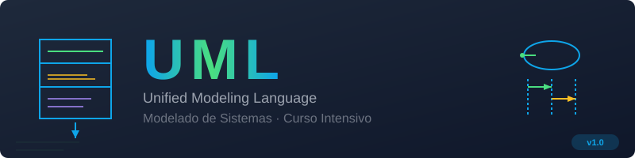

<div align="center">
  
</div>

<div align="center">

[200~cd /home/ergrato-dev/Documents/ergrato-dev/sicora/sicora-app/sicora-be-go/helpdeskservice Sesiones](https://img.shields.io/badge/2_Sesiones-intensivas-8b5cf6?style=flat-square)


**Bootcamp intensivo de UML para desarrolladores de software**  
Domina el modelado de sistemas en 2 sesiones de 5 horas · 23 diagramas SVG · Ejercicios con starter + solución

[Inicio Rápido](#-inicio-rápido) · [Sesión 1](bootcamp/week-01/README.md) · [Sesión 2](bootcamp/week-02/README.md) · [Cheat Sheet](_docs/CHEAT-SHEET.md) · [English](README_EN.md)

</div>

---

## 📚 ¿Qué aprenderás?

Este bootcamp está diseñado para desarrolladores que quieren comunicar y documentar diseños de software con **UML 2.5** de forma profesional.

| Sesión | Tema | Horas | Estado |
|--------|------|-------|--------|
| **Sesión 1** | Fundamentos + Diagramas Estructurales | 5h | ✅ Disponible |
| **Sesión 2** | Diagramas de Comportamiento | 5h | ✅ Disponible |

### Resumen de contenidos

**Sesión 1 — Diagramas Estructurales:**
- Taxonomía UML: 14 diagramas estándar
- Diagrama de Clases: sintaxis, visibilidad, relaciones (6 tipos)
- Diagrama de Objetos, Componentes y Despliegue

**Sesión 2 — Diagramas de Comportamiento:**
- Casos de Uso: actores, include, extend
- Diagrama de Secuencia: lifelines, fragmentos combinados (alt/opt/loop)
- Diagrama de Comunicación: numeración jerárquica
- Máquinas de Estados: compuestos, guardas, acciones
- Diagramas de Actividades: swimlanes, fork/join

---

## 📁 Estructura del Repositorio

```
bc-uml/
├── README.md                           # ← Estás aquí
├── README_EN.md                        # Versión en inglés
├── LICENSE                             # MIT
├── CONTRIBUTING.md                     # Cómo contribuir
├── CODE_OF_CONDUCT.md                  # Código de conducta
├── SECURITY.md                         # Política de seguridad
│
├── bootcamp/
│   ├── week-01/                       # Fundamentos + Estructurales (5h)
│   │   ├── README.md                   # Objetivos, cronograma, checklist
│   │   ├── rubrica-evaluacion.md       # Conocimiento 30% / Desempeño 40% / Producto 30%
│   │   ├── 0-assets/                   # 15 SVGs de la sesión
│   │   ├── 1-teoria/                   # 5 archivos teoría (01 al 05)
│   │   ├── 2-practicas/                # 3 ejercicios con starter + solución
│   │   ├── 3-proyecto/                 # Proyecto: Sistema Biblioteca
│   │   ├── 4-recursos/                 # Webgrafía, videografía, ebooks
│   │   └── 5-glosario/                 # Glosario A-Z de términos estructurales
│   │
│   └── week-02/                       # Comportamiento (5h)
│       ├── README.md                   # Objetivos, cronograma, checklist
│       ├── rubrica-evaluacion.md       # Misma rubrica adaptada
│       ├── 0-assets/                   # 8 SVGs de la sesión
│       ├── 1-teoria/                   # 5 archivos teoría (01 al 05)
│       ├── 2-practicas/                # 3 ejercicios con starter + solución
│       ├── 3-proyecto/                 # Proyecto: Hospital Digital
│       ├── 4-recursos/                 # Webgrafía, videografía, ebooks
│       └── 5-glosario/                 # Glosario términos de comportamiento
│
├── _assets/                            # 23 SVGs globales (tema dark)
├── _docs/                              # Plan de estudios, cheat sheet, guías
└── _scripts/                           # Scripts de exportación PDF
```

---

## 🚀 Inicio Rápido

### Requisitos previos

- VS Code con las extensiones recomendadas (ver `.vscode/extensions.json`)
- Conocimientos básicos de POO (clases, herencia, interfaces)
- No se requiere experiencia previa en UML

### Pasos

```bash
# 1. Clona el repositorio
git clone https://github.com/ergrato-dev/bc-uml.git
cd bc-uml

# 2. Abre en VS Code
code .

# 3. Instala las extensiones recomendadas
# VS Code te pedirá instalarlas automáticamente
```

Luego abre [`bootcamp/week-01/README.md`](bootcamp/week-01/README.md) y sigue el cronograma.

---

## 🎯 Modelo de Evaluación

Cada sesión evalúa tres dimensiones:

| Dimensión | Peso | Instrumento |
|-----------|------|-------------|
| 🧠 **Conocimiento** | 30% | Cuestionarios teóricos |
| 💪 **Desempeño** | 40% | Ejercicios prácticos (`2-practicas/`) |
| 📦 **Producto** | 30% | Proyecto final (`3-proyecto/`) |

> **Criterio de aprobación**: mínimo **70%** en cada dimensión

---

## ⏱️ Distribución de Tiempo por Sesión (5 horas)

```
📖 Teoría:        2h   (40%)   → 1-teoria/
💻 Prácticas:     2h   (40%)   → 2-practicas/
🚀 Proyecto:      0.5h (10%)   → 3-proyecto/
📚 Recursos:      0.5h (10%)   → 4-recursos/
```

---

## 🧩 Herramientas

| Herramienta | Uso | Costo |
|-------------|-----|-------|
| **PlantUML** (extensión VS Code) | Renderizar `.puml` | Gratuito |
| **PlantUML Online** | Sin instalación | Gratuito |
| **Draw.io** | Diagramas visuales | Gratuito |
| **Mermaid** | Diagramas en Markdown | Gratuito |

---

## 📖 Documentación

| Documento | Descripción |
|-----------|-------------|
| [Cheat Sheet](_docs/CHEAT-SHEET.md) | Guía rápida de notación PlantUML |
| [Plan de Estudios](_docs/plan-estudios.md) | Programa completo del bootcamp |
| [Guía de Contenidos](_docs/guia-desarrollo-contenidos.md) | Cómo agregar nuevo material |

---

## 🤝 Contribuir

Lee [CONTRIBUTING.md](CONTRIBUTING.md) antes de enviar un PR.  
Este proyecto usa **Conventional Commits**: `feat:`, `fix:`, `docs:`.

---

## 📜 Licencia

[MIT](LICENSE) © 2026 ergrato-dev

---

<div align="center">

Hecho con 💜 para la comunidad de desarrolladores en español

</div>
