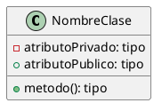
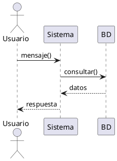
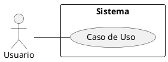
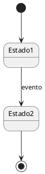
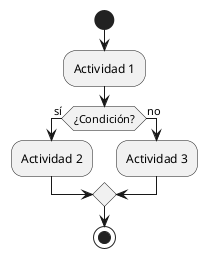

# Guía Rápida de UML - Cheat Sheet

## 📋 Referencia Rápida de Notación

---

## 1️⃣ DIAGRAMA DE CLASES ⭐⭐⭐⭐⭐

### Sintaxis de Clase

```
┌─────────────────┐
│   NombreClase   │  ← Nombre (obligatorio)
├─────────────────┤
│ - atributo: tipo│  ← Atributos (opcional)
│ + atributo: tipo│
├─────────────────┤
│ + método(): tipo│  ← Métodos (opcional)
│ - método(): tipo│
└─────────────────┘
```

### Visibilidad

- `+` **public** - Accesible desde cualquier lugar
- `-` **private** - Solo dentro de la clase
- `#` **protected** - Clase y subclases
- `~` **package** - Mismo paquete

### Relaciones (de más fuerte a más débil)

#### 1. Composición (contiene, ciclo de vida dependiente)

```
Casa ◆━━━━━ Habitación
     1    1..*
```

**Notación**: Diamante negro lleno  
**Significado**: Si Casa se destruye, Habitación también

#### 2. Agregación (contiene, ciclo de vida independiente)

```
Departamento ◇━━━━━ Empleado
             1    1..*
```

**Notación**: Diamante blanco vacío  
**Significado**: Departamento tiene Empleados, pero existen independientemente

#### 3. Asociación (relación general)

```
Estudiante ━━━━━━━ Curso
          *      *
```

**Notación**: Línea sólida  
**Multiplicidades comunes**:

- `1` - Exactamente uno
- `0..1` - Cero o uno (opcional)
- `*` o `0..*` - Cero o muchos
- `1..*` - Uno o muchos
- `n..m` - Entre n y m

#### 4. Herencia / Generalización

```
    Vehículo
        △
        │
   ┌────┼────┐
  Auto Moto Camión
```

**Notación**: Flecha con triángulo vacío  
**Significado**: "es un tipo de"

#### 5. Realización (implementación de interfaz)

```
«interface»
  Payable
     △
     ┊ (línea punteada)
     │
 CreditCard
```

**Notación**: Flecha con triángulo vacío y línea punteada  
**Significado**: Implementa la interfaz

#### 6. Dependencia (usa temporalmente)

```
Printer ┄┄┄┄┄→ Document
```

**Notación**: Flecha punteada  
**Significado**: Usa temporalmente (como parámetro, variable local)

---

## 2️⃣ DIAGRAMA DE CASOS DE USO ⭐⭐⭐⭐⭐

### Elementos

#### Actor

```
  ○      ┌─────────┐
 /│\  o  │«actor» │
 / \     │ Sistema │
         └─────────┘
```

**Humano**: Stick figure  
**Sistema**: Rectángulo con «actor»

#### Caso de Uso

```
  ┌───────────────┐
 (  Realizar Acción )
  └───────────────┘
```

**Notación**: Elipse

#### Sistema

```
┌─────────────────────┐
│  Sistema de Ventas  │
│                     │
│   (casos de uso)    │
└─────────────────────┘
```

**Notación**: Rectángulo grande

### Relaciones

#### Asociación (actor-caso)

```
Actor ───────── (Caso de Uso)
```

#### Include (siempre se ejecuta)

```
(Realizar Compra) ┄┄→ (Validar Stock)
                «include»
```

**Uso**: El caso base SIEMPRE ejecuta el incluido

#### Extend (opcionalmente se ejecuta)

```
(Aplicar Cupón) ┄┄→ (Realizar Compra)
              «extend»
```

**Uso**: Funcionalidad opcional que PUEDE ejecutarse

---

## 3️⃣ DIAGRAMA DE SECUENCIA ⭐⭐⭐⭐⭐

### Elementos

#### Participantes

```
  Actor      Objeto     Sistema
    ○      ┌────────┐  ┌────────┐
   /|\     │:Clase  │  │Sistema │
   / \     └────────┘  └────────┘
    │          │           │
    │          │           │  ← Lifeline (línea de vida)
```

#### Mensajes

```
─────────────→  Síncrono (espera respuesta)
┄┄┄┄┄┄┄┄┄┄┄→  Asíncrono (no espera)
←─ ─ ─ ─ ─ ─  Retorno
```

#### Activación

```
    │
    │  ┌─┐
    │  │ │  ← Objeto activo (procesando)
    │  │ │
    │  └─┘
    │
```

### Fragmentos Combinados

#### alt (if-else)

```
┌─────────────────────────────┐
│alt                          │
│  [condición verdadera]      │
│    mensajes...              │
├─────────────────────────────┤
│  [else]                     │
│    mensajes...              │
└─────────────────────────────┘
```

#### opt (if)

```
┌─────────────────────────────┐
│opt [condición]              │
│    mensajes...              │
└─────────────────────────────┘
```

#### loop (bucle)

```
┌─────────────────────────────┐
│loop [condición] o [n veces] │
│    mensajes...              │
└─────────────────────────────┘
```

#### par (paralelo)

```
┌─────────────────────────────┐
│par                          │
│    mensajes grupo 1         │
├─────────────────────────────┤
│    mensajes grupo 2         │
└─────────────────────────────┘
```

---

## 4️⃣ DIAGRAMA DE ESTADOS ⭐⭐⭐⭐

### Elementos

#### Estado Inicial

```
 ● ← Círculo negro lleno
```

#### Estado

```
┌────────────┐
│  Estado    │
└────────────┘
```

#### Estado Final

```
 ◉ ← Círculo con borde (bull's eye)
```

### Transiciones

```
[Estado1] ─evento [guarda] / acción─→ [Estado2]

Donde:
- evento: Lo que dispara la transición
- [guarda]: Condición opcional
- /acción: Operación opcional
```

### Ejemplo

```
● → [Creado] ─aprobar [cumpleRequisitos]─→ [Aprobado] → ◉
                ↓
             rechazar
                ↓
           [Rechazado] → ◉
```

---

## 5️⃣ DIAGRAMA DE ACTIVIDADES ⭐⭐⭐⭐

### Elementos

#### Inicio/Fin

```
● ← Inicio
◉ ← Fin
```

#### Actividad

```
┌──────────────┐
│  Actividad   │  ← Rectángulo con bordes redondeados
└──────────────┘
```

#### Decisión (if)

```
    ◇  ← Rombo
   ╱ ╲
  ╱   ╲
 ╱ ¿?  ╲
 ╲     ╱
  ╲   ╱
   ╲ ╱
    ◇
```

#### Merge (unir decisiones)

```
   │ │
   ↓ ↓
    ◇  ← Mismo símbolo que decisión
    │
```

#### Fork (dividir en paralelo)

```
    │
────┼────  ← Barra horizontal gruesa
    │
  │ │ │
```

#### Join (unir paralelos)

```
  │ │ │
────┼────  ← Barra horizontal gruesa
    │
```

### Swimlanes (Carriles)

```
┌─────────────────────────────┐
│     Actor/Rol               │
├─────────────────────────────┤
│                             │
│  (actividades del actor)    │
│                             │
└─────────────────────────────┘
```

---

## 6️⃣ DIAGRAMA DE OBJETOS ⭐⭐⭐

### Notación

```
┌────────────────┐
│ nombre:Clase   │  ← Nombre subrayado
├────────────────┤
│ atrib = "valor"│  ← Valores concretos
│ atrib = 123    │
└────────────────┘
```

**Diferencia con Clases**:

- Objetos tienen valores concretos
- Nombres subrayados
- Representan snapshot en tiempo específico

---

## 7️⃣ DIAGRAMA DE COMPONENTES ⭐⭐⭐

### Notación de Componente

```
┌───┐
│ ┌┐│
│ └┘│  ← Icono de componente
├───┴─────────────┐
│  NombreComp     │
└─────────────────┘
```

### Dependencias

```
ComponenteA ┄┄┄→ ComponenteB
```

**Línea punteada**: A depende de B

### Interfaces

```
ComponenteA ──○ IInterface  ← Interfaz provista (lollipop)
ComponenteB ──( IInterface  ← Interfaz requerida (socket)
```

---

## 8️⃣ DIAGRAMA DE DESPLIEGUE ⭐⭐⭐

### Nodo

```
┌──────────────┐
│              │
│   <<device>> │
│  Web Server  │
│              │
└──────────────┘
```

**Notación**: Cubo 3D (representado como rectángulo con «device»)

### Artefacto

```
┌────────────┐
│ archivo.jar│ ← Icono de documento
└────────────┘
```

### Comunicación

```
Nodo1 ════════ Nodo2
       HTTP
```

**Protocolo**: Etiqueta sobre la línea

---

## 🎨 CONVENCIONES DE COLOR (tema dark)

- **Azul (#0ea5e9)**: Elementos principales, títulos
- **Verde (#4ade80)**: Flujos positivos, asociaciones
- **Rojo (#f87171)**: Errores, cancelaciones
- **Amarillo (#fbbf24)**: Advertencias, condiciones
- **Púrpura (#a78bfa)**: Fragmentos, interfaces
- **Gris (#6b7280)**: Elementos secundarios

---

## 📊 CUÁNDO USAR CADA DIAGRAMA

| Diagrama         | Cuándo Usar                      | Importancia |
| ---------------- | -------------------------------- | ----------- |
| **Clases**       | Diseño estructural del sistema   | ⭐⭐⭐⭐⭐  |
| **Casos de Uso** | Captura de requisitos            | ⭐⭐⭐⭐⭐  |
| **Secuencia**    | Flujos de interacción detallados | ⭐⭐⭐⭐⭐  |
| **Estados**      | Ciclos de vida de objetos        | ⭐⭐⭐⭐    |
| **Actividades**  | Procesos de negocio, workflows   | ⭐⭐⭐⭐    |
| **Componentes**  | Arquitectura del sistema         | ⭐⭐⭐      |
| **Objetos**      | Ejemplos concretos, debugging    | ⭐⭐⭐      |
| **Despliegue**   | Infraestructura física/cloud     | ⭐⭐⭐      |

---

## 💡 BUENAS PRÁCTICAS GENERALES

### ✅ HACER

- Usar nombres descriptivos en español o inglés consistente
- Mantener diagramas simples (máximo 10-15 elementos)
- Documentar decisiones importantes
- Usar niveles de detalle apropiados
- Mantener consistencia entre diagramas
- Agregar notas explicativas cuando sea necesario

### ❌ EVITAR

- Mezclar idiomas en un mismo diagrama
- Sobrecargar con demasiados elementos
- Usar abreviaciones confusas
- Omitir multiplicidades en asociaciones importantes
- Crear diagramas sin contexto
- Usar UML por usar UML (pragmatismo)

---

## 🔗 TRAZABILIDAD

```
Requisito
   ↓
Caso de Uso (captura requisito)
   ↓
Diagrama de Clases (diseño estructural)
   ↓
Diagrama de Secuencia (implementación del caso)
   ↓
Diagrama de Estados (comportamiento de clases)
   ↓
Diagrama de Componentes (arquitectura)
   ↓
Diagrama de Despliegue (infraestructura)
```

---

## 📚 HERRAMIENTAS RECOMENDADAS

1. **PlantUML** - Diagramas desde código
2. **Draw.io** - Editor visual online
3. **Visual Paradigm** - Suite profesional
4. **Lucidchart** - Colaboración en tiempo real
5. **StarUML** - Herramienta standalone

---

## 🔤 PLANTILLAS PLANTUML

### Clase



### Secuencia



### Caso de Uso



### Estados



### Actividades



---

## 📖 REFERENCIAS RÁPIDAS

- **UML 2.5 Spec**: https://www.omg.org/spec/UML/
- **PlantUML**: https://plantuml.com/
- **Martin Fowler UML**: https://martinfowler.com/bliki/UmlMode.html

---

**Versión**: 1.0  
**Fecha**: Noviembre 2025  
**Curso**: UML - Modelado de Sistemas
