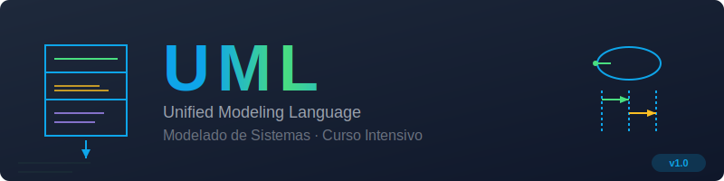

# ✅ Logo SVG Creado - Resumen

**Fecha**: 5 de noviembre de 2025  
**Acción**: Creación de logos para el curso UML

---

## 🎨 Logos Creados

### 1. **Logo Banner** (`logo-uml-course.svg`)
- ✅ Dimensiones: 800×200px (formato horizontal)
- ✅ Ubicación: `assets/logo-uml-course.svg`
- ✅ Uso: Encabezado del README principal
- ✅ Características:
  - Diagrama de clases miniatura
  - Texto "UML" con gradiente cyan→green
  - Subtítulos: "Unified Modeling Language" + "Modelado de Sistemas"
  - Iconos de casos de uso y secuencia
  - Tag de versión v1.0
  - Tema dark coherente con todo el curso

### 2. **Logo Icono** (`logo-icon.svg`)
- ✅ Dimensiones: 200×200px (formato cuadrado)
- ✅ Ubicación: `assets/logo-icon.svg`
- ✅ Uso: Favicon, redes sociales, avatar
- ✅ Características:
  - Diagrama de herencia con 3 subclases
  - Diseño circular con gradiente en borde
  - Texto "UML" centrado
  - Puntos decorativos en 4 esquinas
  - Colores: azul, verde, rojo, amarillo

### 3. **Documentación** (`README-LOGOS.md`)
- ✅ Ubicación: `assets/README-LOGOS.md`
- ✅ Contenido:
  - Especificaciones técnicas
  - Paleta de colores
  - Guía de uso
  - Comandos de exportación a PNG
  - Variantes sugeridas

---

## 📝 Actualización del README Principal

El `README.md` ahora incluye el logo en el encabezado:

```markdown
<div align="center">
  
</div>

---

## 📚 Descripción del Curso
...
```

---

## 🎨 Paleta de Colores Utilizada

| Color | Hex | Uso en Logo |
|-------|-----|-------------|
| **Azul Primario** | `#0ea5e9` | Bordes, líneas principales, texto |
| **Verde Secundario** | `#4ade80` | Gradiente, clase destacada |
| **Rojo Acento** | `#f87171` | Subclase, decoración |
| **Amarillo** | `#fbbf24` | Atributos, subclase |
| **Púrpura** | `#a78bfa` | Métodos, decoración |
| **Gris Claro** | `#e5e5e5` | Texto principal |
| **Gris Medio** | `#9ca3af` | Subtítulos |
| **Fondo Oscuro** | `#1e293b` | Background con gradiente |

---

## 📊 Estadísticas Actualizadas

### Assets Totales
- **Antes**: 23 SVG de diagramas
- **Ahora**: 25 SVG (23 diagramas + 2 logos)
- **Documentos en assets**: 1 README (logos)

### Archivos Totales del Proyecto
```
bc-uml/
├── README.md (1)
├── _docs/ (6 archivos)
├── modulos/ (8 archivos)
└── assets/ (25 SVG + 1 README = 26)
────────────────────────────────
Total: 42 archivos
```

---

## ✅ Características del Diseño

### 🎯 Coherencia Visual
- ✅ Mismo tema dark que todos los SVG del curso
- ✅ Paleta de colores consistente
- ✅ Tipografía sans-serif (Arial/Helvetica)
- ✅ Alto contraste para legibilidad

### 📐 Elementos UML Reconocibles
- ✅ Diagrama de clases con compartimentos
- ✅ Herencia con flecha triangular
- ✅ Casos de uso (elipse)
- ✅ Diagrama de secuencia (lifelines + mensajes)
- ✅ Notación UML estándar

### 🚀 Profesionalismo
- ✅ Diseño moderno y limpio
- ✅ Gradientes sutiles sin saturación
- ✅ Jerarquía visual clara
- ✅ Escalable (SVG vectorial)
- ✅ Optimizado (tamaños: 8KB banner, 5KB icono)

### 📱 Versatilidad
- ✅ Banner horizontal para README
- ✅ Icono cuadrado para otros usos
- ✅ Fácil exportación a PNG
- ✅ Responsive (se ve bien en cualquier tamaño)

---

## 🔧 Uso en Diferentes Contextos

### GitHub README
```markdown
<div align="center">
  
</div>
```

### Documentación Interna
```markdown

```

### Favicon (exportar a PNG primero)
```html
<link rel="icon" type="image/png" href="favicon-64.png">
```

### Open Graph (redes sociales)
```html
<meta property="og:image" content="logo-social.png">
```

---

## 📦 Próximos Pasos Opcionales

Si se requieren más versiones:

1. **Logo Light Mode** - Para documentación con fondo blanco
2. **Logo Animado** - Con transiciones CSS para web
3. **Badges** - "UML Certified", "Course Complete", "100% Completo"
4. **Variantes de Color** - Para diferentes módulos
5. **Logo Minimalista** - Solo texto sin gráficos
6. **Wallpapers** - Para uso en presentaciones

---

## ✅ Estado del Proyecto

| Componente | Antes | Ahora | Estado |
|------------|-------|-------|--------|
| **README con logo** | ❌ | ✅ | Actualizado |
| **Logo banner** | ❌ | ✅ | Creado |
| **Logo icono** | ❌ | ✅ | Creado |
| **Documentación logos** | ❌ | ✅ | Creada |
| **SVG totales** | 23 | 25 | +2 |
| **Archivos totales** | 38 | 42 | +4 |

---

## 🎉 Resultado

El curso UML ahora tiene:

✅ **Identidad visual profesional**  
✅ **Logo coherente con el diseño del curso**  
✅ **README impactante con banner**  
✅ **Documentación completa de branding**  
✅ **Listo para publicación y promoción**

---

**Última actualización**: 5 de noviembre de 2025, 14:15h  
**Creado por**: GitHub Copilot  
**Estado**: ✅ COMPLETADO
