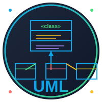

# 🎨 Logos del Curso UML

Este directorio contiene los logos oficiales del curso.

---

## 📁 Archivos Disponibles

### 1. `logo-uml-course.svg`

**Uso**: Banner principal para README y documentación

- **Dimensiones**: 800×200px
- **Formato**: Horizontal
- **Elementos**:
  - Diagrama de clases miniatura
  - Texto "UML" con gradiente
  - Subtítulos descriptivos
  - Iconos de casos de uso y secuencia
  - Tag de versión
- **Colores**:
  - Fondo: `#1e293b` → `#0f172a` (gradiente)
  - Primario: `#0ea5e9` (azul)
  - Secundario: `#4ade80` (verde)
  - Acento: `#f87171` (rojo)
  - Warning: `#fbbf24` (amarillo)
  - Purple: `#a78bfa` (púrpura)

**Preview**:


---

### 2. `logo-icon.svg`

**Uso**: Icono, favicon, redes sociales

- **Dimensiones**: 200×200px
- **Formato**: Circular/Cuadrado
- **Elementos**:
  - Diagrama de herencia con 3 subclases
  - Círculo con gradiente
  - Texto "UML" centrado
  - Puntos decorativos en esquinas
- **Colores**: Misma paleta que el banner

**Preview**:


---

## 🎨 Paleta de Colores

| Color            | Hex       | Uso                              |
| ---------------- | --------- | -------------------------------- |
| **Azul**         | `#0ea5e9` | Principal, líneas, bordes        |
| **Verde**        | `#4ade80` | Secundario, clases, asociaciones |
| **Rojo**         | `#f87171` | Acentos, warnings                |
| **Amarillo**     | `#fbbf24` | Atributos, highlights            |
| **Púrpura**      | `#a78bfa` | Métodos, herencia                |
| **Gris claro**   | `#e5e5e5` | Texto principal                  |
| **Gris medio**   | `#9ca3af` | Texto secundario                 |
| **Fondo oscuro** | `#1a1a1a` | Fondo principal                  |

---

## 📐 Especificaciones Técnicas

### Banner (`logo-uml-course.svg`)

```
Ancho: 800px
Alto: 200px
Ratio: 4:1
Formato: SVG vectorial
Tamaño: ~8KB
Background: Gradiente oscuro
Border-radius: 10px
```

### Icono (`logo-icon.svg`)

```
Ancho: 200px
Alto: 200px
Ratio: 1:1
Formato: SVG vectorial
Tamaño: ~5KB
Background: Circular gradiente
```

---

## 🔧 Uso en Markdown

### Banner en README

```markdown
<div align="center">
  
</div>
```

### Icono

```markdown

```

---

## 📱 Exportación a Otros Formatos

Para exportar a PNG (si necesario):

### Banner

```bash
# Usando Inkscape
inkscape logo-uml-course.svg --export-type=png --export-width=1600 --export-filename=logo-uml-course.png

# Usando ImageMagick
convert -density 300 -background none logo-uml-course.svg logo-uml-course.png
```

### Icono

```bash
# Para favicon (16×16, 32×32, 64×64)
inkscape logo-icon.svg --export-type=png --export-width=64 --export-filename=favicon-64.png

# Para redes sociales (1200×1200)
inkscape logo-icon.svg --export-type=png --export-width=1200 --export-filename=logo-social.png
```

---

## ✅ Características del Diseño

### ✓ Tema Oscuro

- Coherente con todos los SVG del curso
- Fondo `#1a1a1a` / `#1e293b`
- Alto contraste

### ✓ Elementos UML Reconocibles

- Diagrama de clases
- Herencia con flecha
- Casos de uso (elipse)
- Diagrama de secuencia (lifelines)

### ✓ Tipografía Sans-serif

- Arial / Helvetica
- Coherente con curso completo

### ✓ Escalable

- Formato SVG vectorial
- Se ve bien en cualquier tamaño
- Sin pérdida de calidad

### ✓ Profesional

- Diseño limpio y moderno
- Gradientes sutiles
- Buena jerarquía visual

---

## 🎯 Variantes Sugeridas (futuro)

Si se necesitan más versiones:

1. **Logo Light Mode** - Para fondos claros
2. **Logo Monocromático** - Solo azul y blanco
3. **Logo Animado** - Con transiciones CSS
4. **Badges** - "UML Certified", "Course Complete"

---

## 📄 Licencia

Los logos son parte del material educativo del curso y pueden usarse libremente en contextos relacionados al curso.

---

**Última actualización**: 5 de noviembre de 2025  
**Versión**: 1.0  
**Diseñador**: GitHub Copilot
