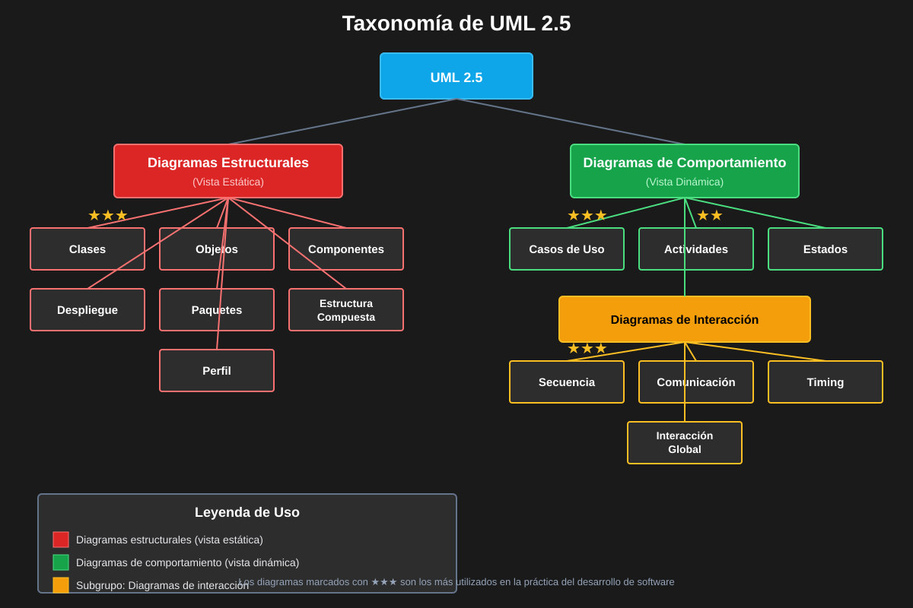

# 01 — Introducción a UML

> ⏱️ Duración estimada: **25 minutos**

## 🎯 Objetivos

- Comprender qué es UML y su importancia en el desarrollo de software
- Conocer la historia, evolución y el organismo que lo estandariza
- Identificar los 14 tipos de diagramas y su clasificación
- Entender la relación entre UML y el diseño orientado a objetos

---

## 🎥 Video de Refuerzo

📺 **UML: El Plano para el Software**

👉 [Ver video en Dropbox](https://www.dropbox.com/scl/fi/a56f6rip3ez3ez1oe3evh/1.1.UML__El_Plano_para_el_Software.mp4?rlkey=p4noshv6t8whdua59fafnrar6&st=ab1ia0hz&dl=0)

---

## 📖 ¿Qué es UML?

**UML (Unified Modeling Language)** es un lenguaje de modelado visual estandarizado por el OMG
(Object Management Group). Su propósito es:

| Uso             | Descripción                                       |
| --------------- | ------------------------------------------------- |
| **Especificar** | Definir estructuras y comportamientos de sistemas |
| **Visualizar**  | Representar gráficamente el diseño del software   |
| **Construir**   | Guiar la implementación del código                |
| **Documentar**  | Crear documentación técnica comprensible          |

> UML no es un lenguaje de programación — es un **lenguaje de comunicación** entre personas que diseñan sistemas.

---

## 🏛️ Historia de UML

```
1994 ─┬─ Grady Booch    (Método Booch)
      ├─ James Rumbaugh  (OMT — Object Modeling Technique)
      └─ Ivar Jacobson   (OOSE — Object-Oriented Software Engineering)
         │
         ▼  Los "Tres Amigos" se unen en Rational Software
         │
1997 ─── UML 1.0 → Adoptado por OMG como estándar
         │
2005 ─── UML 2.0 → Revisión mayor, 13 tipos de diagramas
         │
2011 ─── UML 2.4.1
         │
2017 ─── UML 2.5.1 → Versión actual (simplificada)
```

**Hito clave**: En 1997, UML 1.0 reemplazó decenas de metodologías incompatibles por un único
estándar industrial. Hoy es el lenguaje de modelado más usado en el mundo.

---

## 📊 Los 14 Tipos de Diagramas UML 2.5

UML 2.5 define **14 tipos de diagramas** en dos categorías:



### Categoría 1: Diagramas Estructurales (Static)

Muestran la **estructura estática** del sistema — qué existe y cómo está organizado.

| #   | Diagrama                 | Propósito                                             | Frecuencia de Uso |
| --- | ------------------------ | ----------------------------------------------------- | ----------------- |
| 1   | **Clases**               | Estructura de clases, atributos, métodos y relaciones | ⭐⭐⭐⭐⭐        |
| 2   | **Objetos**              | Instancias concretas de clases en un momento dado     | ⭐⭐⭐            |
| 3   | **Componentes**          | Organización modular del sistema                      | ⭐⭐⭐⭐          |
| 4   | **Despliegue**           | Distribución física de nodos e infraestructura        | ⭐⭐⭐⭐          |
| 5   | **Paquetes**             | Agrupación lógica de elementos del modelo             | ⭐⭐⭐            |
| 6   | **Estructura Compuesta** | Estructura interna de una clase compleja              | ⭐                |
| 7   | **Perfil**               | Extensiones y personalizaciones de UML                | ⭐                |

### Categoría 2: Diagramas de Comportamiento (Dynamic)

Muestran el **comportamiento dinámico** del sistema — qué hace y cómo lo hace.

| #   | Diagrama               | Propósito                                           | Frecuencia de Uso |
| --- | ---------------------- | --------------------------------------------------- | ----------------- |
| 8   | **Casos de Uso**       | Funcionalidades desde la perspectiva del usuario    | ⭐⭐⭐⭐⭐        |
| 9   | **Secuencia**          | Interacciones entre objetos ordenadas en el tiempo  | ⭐⭐⭐⭐⭐        |
| 10  | **Comunicación**       | Interacciones entre objetos estructuralmente        | ⭐⭐⭐            |
| 11  | **Estados**            | Ciclo de vida de un objeto (máquina de estados)     | ⭐⭐⭐⭐          |
| 12  | **Actividades**        | Flujo de procesos y actividades de negocio          | ⭐⭐⭐⭐          |
| 13  | **Timing**             | Restricciones temporales en sistemas de tiempo real | ⭐                |
| 14  | **Interacción Global** | Combinación de diagramas de interacción             | ⭐                |

> 📌 **Regla práctica**: Los diagramas de Clases, Casos de Uso y Secuencia cubren el 80% de los casos reales de modelado.

---

## 🌍 Ejemplo: UML en Netflix

Netflix usa UML para diseñar su sistema de recomendaciones:

| Diagrama     | Uso en Netflix                                                             |
| ------------ | -------------------------------------------------------------------------- |
| Casos de Uso | Definir funcionalidades: ver contenido, recibir recomendaciones, calificar |
| Clases       | Modelar `Usuario`, `Contenido`, `Recomendacion`, `Calificacion`            |
| Secuencia    | Flujo completo de "generar recomendaciones personalizadas"                 |
| Componentes  | Arquitectura de microservicios del sistema de streaming                    |
| Despliegue   | Distribución de servicios en AWS y CDN global                              |

**Resultado**: Comunicación clara entre 20+ equipos distribuidos globalmente.

---

## ✅ Resumen

- UML es el estándar mundial para modelado de software (OMG, desde 1997)
- Tiene 14 tipos de diagramas en 2 categorías: estructurales y de comportamiento
- No reemplaza el código, lo complementa y documenta
- Los 5 diagramas más usados: Clases, Casos de Uso, Secuencia, Componentes, Actividades

---

## 🔗 Navegación

⬅️ [README Sesión 1](../README.md) &nbsp;➡️ Siguiente: [02 — Cuándo Usar UML](02-cuando-usar-uml.md)
