# 04 — Relaciones entre Clases

> ⏱️ Duración estimada: **30 minutos**

## 🎯 Objetivos

- Identificar y aplicar los 6 tipos de relaciones en UML
- Entender la diferencia entre composición y agregación
- Usar multiplicidades correctamente
- Elegir el tipo de relación apropiado para cada situación

---

## 🔗 Los 6 Tipos de Relaciones

UML define 6 tipos de relaciones entre clases, ordenados **de más fuerte a más débil**:

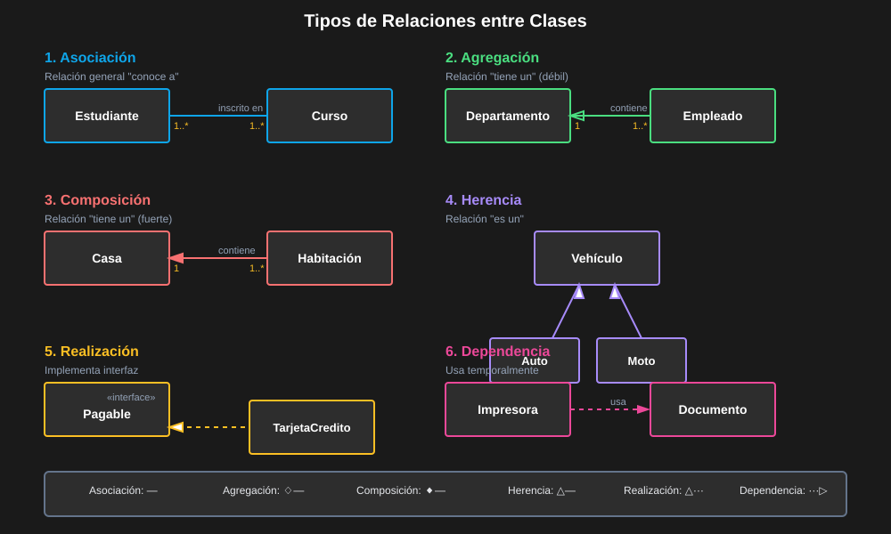

| #   | Relación    | Notación                          | Keyword      | Fuerza     |
| --- | ----------- | --------------------------------- | ------------ | ---------- |
| 1   | Composición | `◆──` Diamante negro              | "parte de"   | ⬛⬛⬛⬛⬛ |
| 2   | Agregación  | `◇──` Diamante blanco             | "tiene un"   | ⬛⬛⬛⬛⬜ |
| 3   | Herencia    | `──▷` Flecha triángulo            | "es un"      | ⬛⬛⬛⬛⬜ |
| 4   | Realización | `····▷` Flecha punteada triángulo | "implementa" | ⬛⬛⬛⬜⬜ |
| 5   | Asociación  | `──` Línea sólida                 | "usa"        | ⬛⬛⬜⬜⬜ |
| 6   | Dependencia | `····>` Flecha punteada           | "depende de" | ⬛⬜⬜⬜⬜ |

---

## 1️⃣ Composición (`◆──`)

**"Las partes no pueden existir sin el todo"** — Ciclo de vida dependiente.

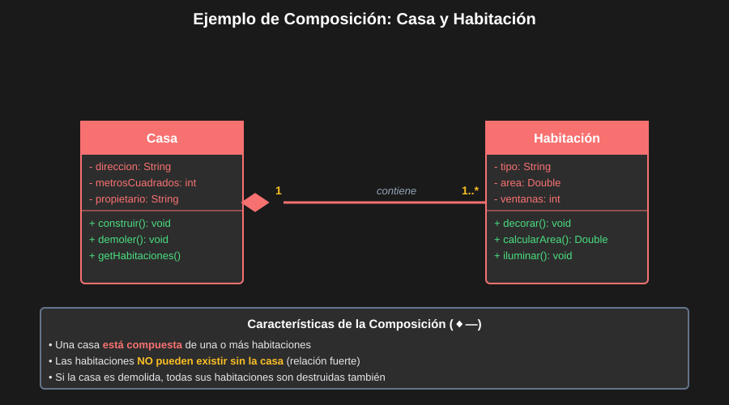

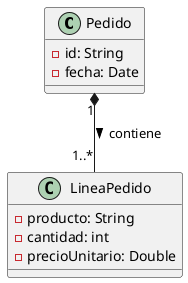

**Cuándo usar composición**:

- Una habitación no existe sin la casa
- `LineaPedido` no existe sin `Pedido`
- Un `Capitulo` no existe sin el `Libro`

---

## 2️⃣ Agregación (`◇──`)

**"Las partes pueden existir sin el todo"** — Ciclo de vida independiente.

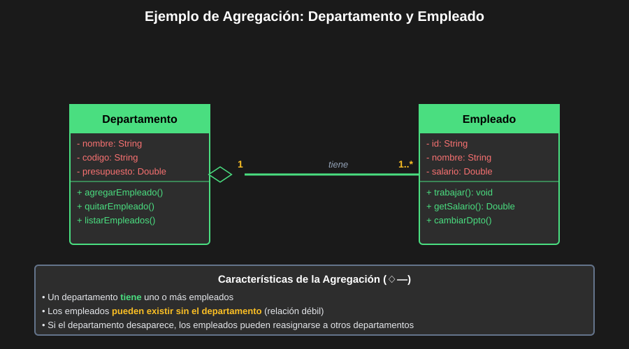

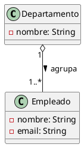

**Cuándo usar agregación**:

- Un empleado puede cambiar de departamento (existe independientemente)
- Un estudiante puede existir sin estar en un curso
- Un autor puede existir sin sus libros

---

## 🧠 Composición vs Agregación — La Prueba Definitiva

> **Pregunta clave**: Si elimino el objeto "contenedor", ¿las partes también dejan de existir?
>
> - **SÍ** → **Composición** (`◆──`)
> - **NO** → **Agregación** (`◇──`)

| Escenario              | ¿Partes sobreviven? | Relación    |
| ---------------------- | ------------------- | ----------- |
| Casa ↔ Habitación      | No                  | Composición |
| Empresa ↔ Empleado     | Sí                  | Agregación  |
| Pedido ↔ LineaPedido   | No                  | Composición |
| Playlist ↔ Canción     | Sí                  | Agregación  |
| Universidad ↔ Facultad | No                  | Composición |

---

## 3️⃣ Herencia / Generalización (`──▷`)

**"Es un tipo de"** — La subclase hereda todos los miembros de la superclase.

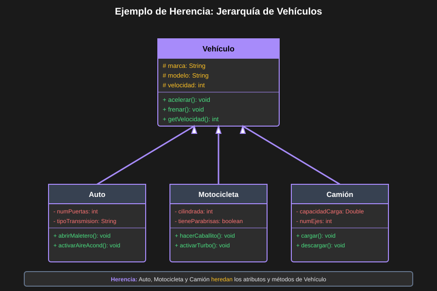

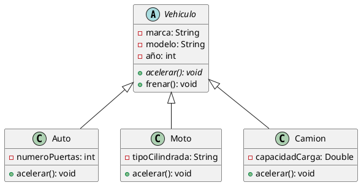

**Regla**: Usa herencia **solo** cuando la relación "es un" es semánticamente válida.

- `Auto` **es un** `Vehiculo` ✅
- `Motor` **es parte de** `Auto` ← usar composición, no herencia ❌

---

## 4️⃣ Realización (`····▷`)

**"Implementa un contrato"** — Una clase concreta implementa una interfaz.

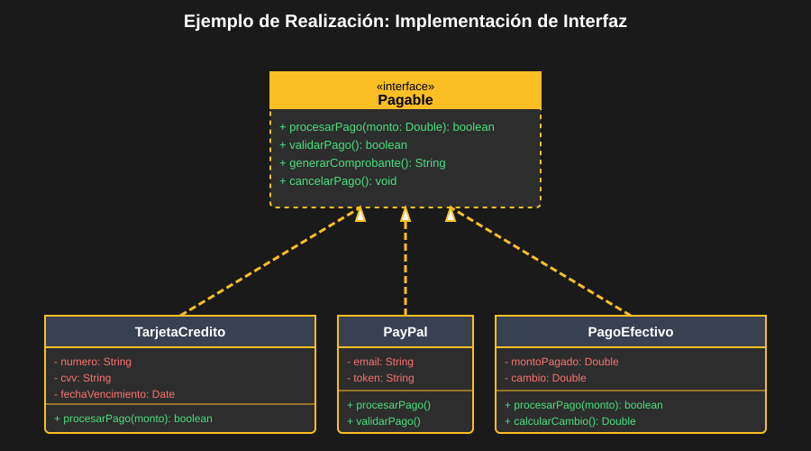

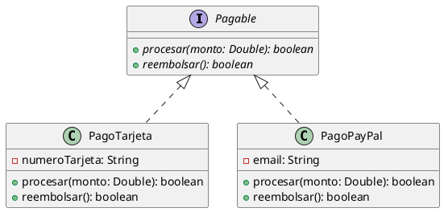

---

## 5️⃣ Asociación (`──`)

**Relación general entre dos clases** sin implicar ciclo de vida compartido.

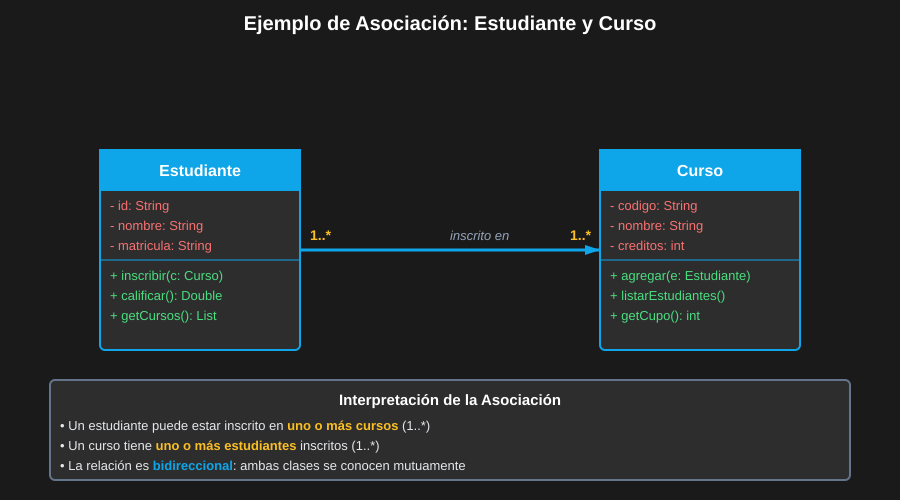

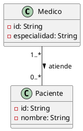

---

## 6️⃣ Dependencia (`····>`)

**Uso temporal o puntual** de una clase por otra — la más débil de todas.

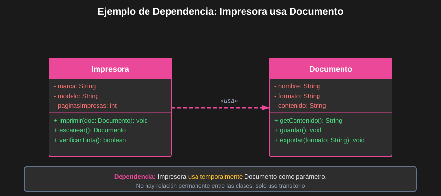

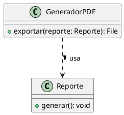

---

## 📐 Multiplicidades

Las multiplicidades definen la **cardinalidad** de la relación:

| Notación     | Significado                 |
| ------------ | --------------------------- |
| `1`          | Exactamente uno             |
| `0..1`       | Cero o uno (opcional)       |
| `*` o `0..*` | Cero o muchos               |
| `1..*`       | Uno o muchos (al menos uno) |
| `2..5`       | Entre 2 y 5                 |
| `n`          | Exactamente n               |

### Ejemplo Completo con Multiplicidades

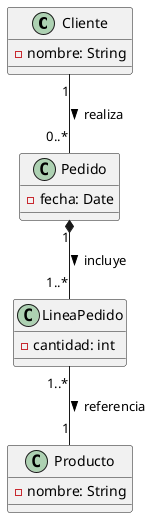

---

## ✅ Guía de Decisión — Qué Relación Usar

```
¿La Clase A hereda comportamiento de Clase B?
  └─ Sí → HERENCIA (A <|-- B)
  └─ No → continúa...

¿La Clase A implementa la interfaz B?
  └─ Sí → REALIZACIÓN (A <|.. B)
  └─ No → continúa...

¿La Clase A "contiene" instancias de Clase B?
  └─ Sí, y B no puede existir sin A → COMPOSICIÓN (A *-- B)
  └─ Sí, y B puede existir sin A → AGREGACIÓN (A o-- B)
  └─ No → continúa...

¿La Clase A "usa" a B temporalmente (parámetro, retorno)?
  └─ Sí → DEPENDENCIA (A ..> B)
  └─ No → ASOCIACIÓN general (A -- B)
```

---

## 🔗 Navegación

⬅️ Anterior: [03 — Diagrama de Clases: Sintaxis](03-diagrama-clases-sintaxis.md) &nbsp;➡️ Siguiente: [05 — Diagramas Estructurales](05-diagramas-estructurales.md)
