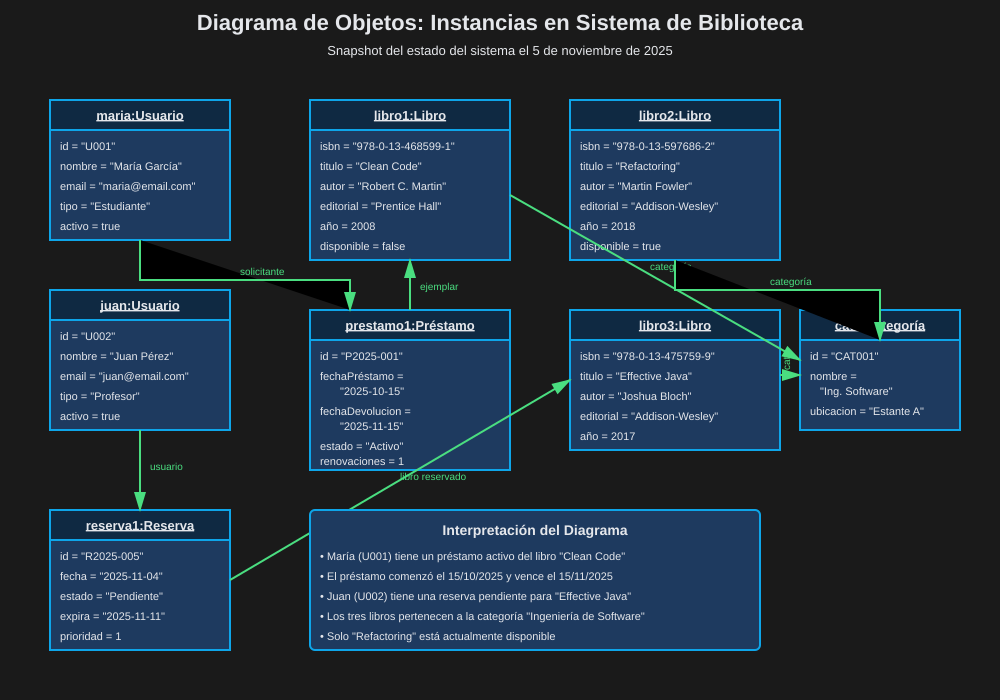
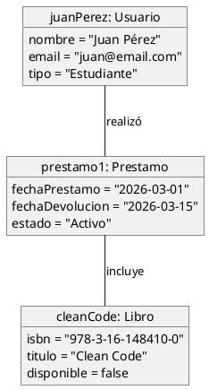
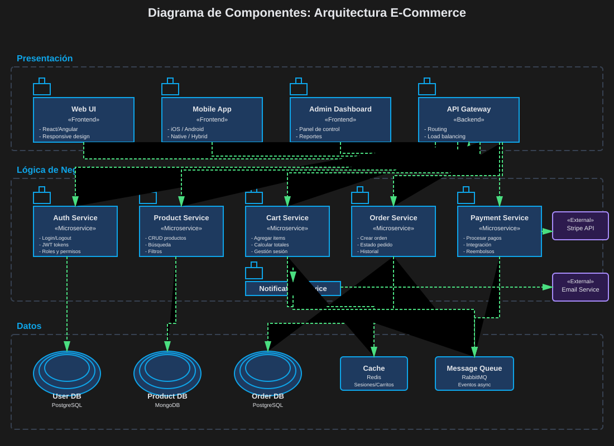
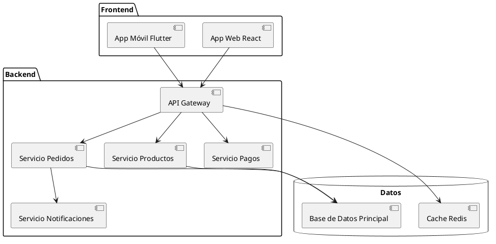
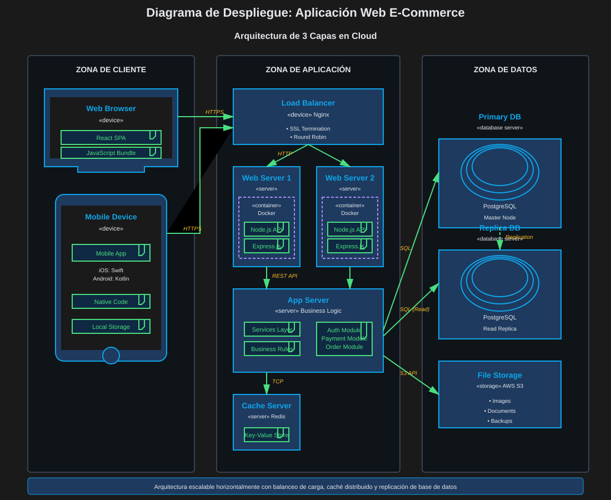
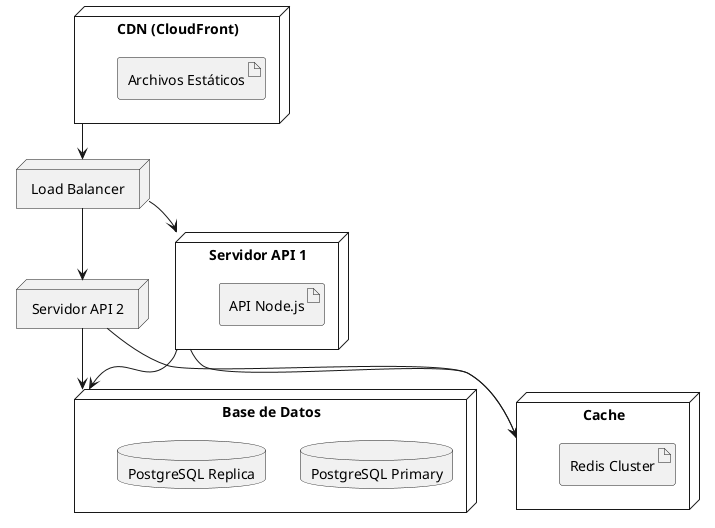

# 05 — Diagramas Estructurales: Objetos, Componentes y Despliegue

> ⏱️ Duración estimada: **15 minutos**

## 🎯 Objetivos

- Comprender qué es un diagrama de objetos y cuándo usarlo
- Distinguir el diagrama de componentes del de despliegue
- Identificar situaciones reales para cada diagrama

---

## 🎥 Video de Refuerzo

📺 **Diagramas Estructurales UML**

👉 [Ver video en Dropbox](https://www.dropbox.com/scl/fi/a8mhoj3z6mvxwm879sncf/1.3.Diagramas_Estructurales_UML.mp4?rlkey=wzn0358lr97zh4zluo7i2x2yf&st=69ecpzx6&dl=0)

---

## 1️⃣ Diagrama de Objetos

### ¿Qué es?

El **Diagrama de Objetos** muestra **instancias concretas** de clases en un momento
específico del tiempo — es como una "fotografía" del sistema en ejecución.

```
Clase (abstracta):          Objeto (instancia):
┌─────────────┐             ┌──────────────────────┐
│  Libro      │             │  cleanCode: Libro     │  ← nombre: Clase
├─────────────┤   →         ├──────────────────────┤
│ isbn        │             │  isbn = "978-..."     │  ← valores concretos
│ titulo      │             │  titulo = "Clean Code"│
│ disponible  │             │  disponible = false   │
└─────────────┘             └──────────────────────┘
```

### Cuándo Usarlo

| Situación                                   | Ejemplo                                    |
| ------------------------------------------- | ------------------------------------------ |
| Ejemplificar un diagrama de clases complejo | "Así se vería para el libro X"             |
| Mostrar datos de prueba o casos de uso      | Estado del sistema a las 10:00am           |
| Validar multiplicidades                     | ¿Realmente un pedido puede tener 0 líneas? |
| Documentar configuraciones específicas      | Estado inicial del sistema                 |

### Ejemplo: Sistema de Biblioteca





---

## 2️⃣ Diagrama de Componentes

### ¿Qué es?

El **Diagrama de Componentes** muestra la **organización modular** del sistema —
cómo están divididos los módulos, servicios o librerías y cómo se comunican.

```
   ┌──────────┐       ┌──────────┐
   │ Frontend │──────►│  API     │
   └──────────┘       └────┬─────┘
                           │
              ┌────────────┼────────────┐
              │            │            │
        ┌─────▼──┐   ┌─────▼──┐  ┌─────▼──┐
        │ Auth   │   │Product │  │Payment │
        │Service │   │Service │  │Service │
        └────────┘   └────────┘  └────────┘
```

### Cuándo Usarlo

- Documentar la arquitectura de microservicios
- Mostrar dependencias entre módulos
- Planificar la división de un monolito
- Comunicar la arquitectura a stakeholders

### Ejemplo: E-Commerce





---

## 3️⃣ Diagrama de Despliegue

### ¿Qué es?

El **Diagrama de Despliegue** muestra la **distribución física** del sistema —
en qué servidores, nodos o dispositivos se ejecuta cada componente.

### Cuándo Usarlo

- Planificar la infraestructura cloud (AWS, GCP, Azure)
- Documentar decisiones de arquitectura de red
- Comunicar con equipos de DevOps/SRE
- Requisitos de seguridad y separación de zonas

### Ejemplo: Aplicación Web





---

## 📊 Comparativa de los 3 Diagramas

| Criterio                 | Objetos                     | Componentes          | Despliegue                   |
| ------------------------ | --------------------------- | -------------------- | ---------------------------- |
| **¿Qué muestra?**        | Instancias en un momento    | Módulos del software | Nodos físicos                |
| **Nivel de abstracción** | Muy concreto (datos reales) | Arquitectónico       | Infraestructura              |
| **Audiencia**            | Desarrolladores             | Arquitectos / Devs   | DevOps / Arquitectos         |
| **Frecuencia de uso**    | ⭐⭐⭐                      | ⭐⭐⭐⭐             | ⭐⭐⭐⭐                     |
| **Cuándo se hace**       | Para ejemplificar clases    | En el diseño técnico | En la planificación de infra |

---

## ✅ Resumen

- **Objeto**: "Fotografía" del sistema — instancias con datos concretos
- **Componente**: Arquitectura del software — módulos y sus dependencias
- **Despliegue**: Infraestructura — dónde vive físicamente cada componente

---

## 🔗 Navegación

⬅️ Anterior: [04 — Relaciones entre Clases](04-relaciones-entre-clases.md) &nbsp;➡️ [Ir a Prácticas](../2-practicas/) | [Ir al Proyecto](../3-proyecto/)
