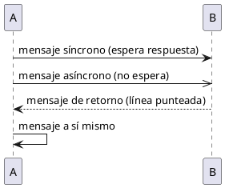
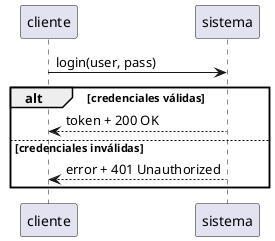
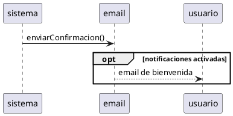
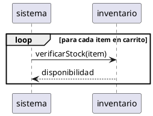
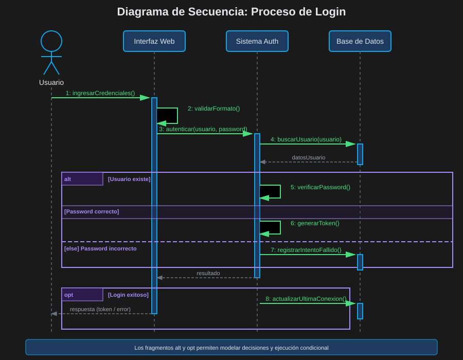
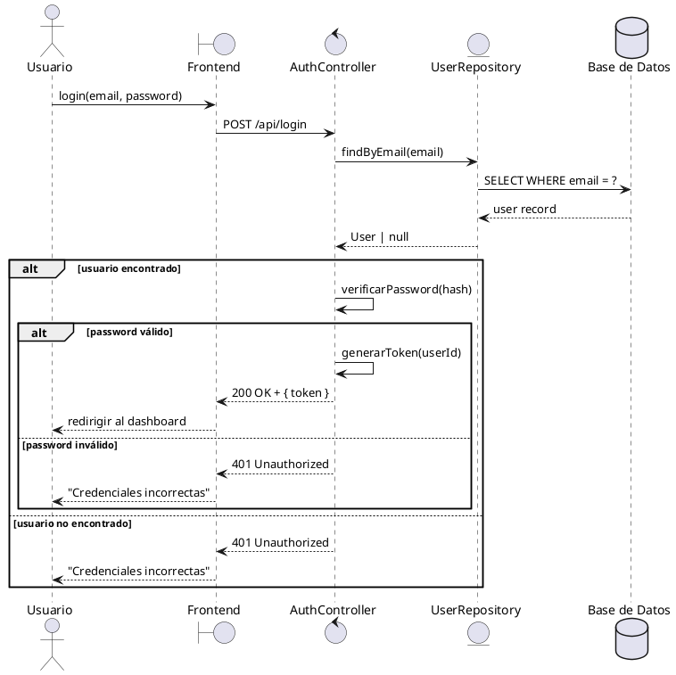
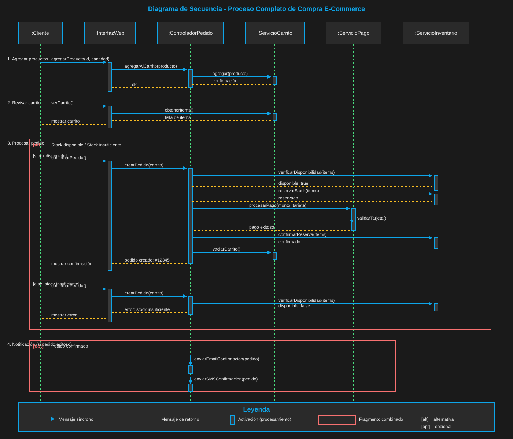

# 02 — Diagrama de Secuencia

> ⏱️ Duración estimada: **35 minutos**

## 🎯 Objetivos

- Dominar el diagrama de secuencia para modelar flujos en el tiempo
- Aplicar los tipos de mensajes y sus notaciones
- Usar fragmentos combinados (alt, opt, loop, par)
- Modelar flujos complejos de sistemas reales

---

## 🎥 Video de Refuerzo

📺 **Conversaciones de Sistemas**

👉 [Ver video en Dropbox](https://www.dropbox.com/scl/fi/lixwy8nn3l95c0gh8x1aw/2.2.Conversaciones_de_Sistemas.mp4?rlkey=yplp5far9dwovwq6ultxsvvuj&st=ujt078ry&dl=0)

---

## 📖 ¿Qué es un Diagrama de Secuencia?

El **Diagrama de Secuencia** muestra cómo los objetos interaction entre sí
**en el tiempo** — el eje vertical representa el tiempo, de arriba hacia abajo.

**Cuándo usarlo**:

- Documentar el flujo detallado de un caso de uso
- Diseñar contratos de API entre servicios
- Entender el comportamiento de un sistema existente
- Comunicar lógica compleja a otros desarrolladores

---

## 🎨 Elementos del Diagrama

### 1. Participantes (Lifelines)

Cada participante tiene una **línea de vida** vertical:

```
  ┌──────────┐     ┌──────────┐     ┌──────────┐
  │ :Actor   │     │ :Clase   │     │ :Sistema │
  └──────────┘     └──────────┘     └──────────┘
       │                │                │
       │                │                │
  (línea de vida — el tiempo fluye hacia abajo)
```

En PlantUML: `actor`, `boundary`, `control`, `entity`, `database`, `participant`

### 2. Mensajes



| Tipo         | Notación                           | Uso                            |
| ------------ | ---------------------------------- | ------------------------------ |
| Síncrono     | `──►` línea sólida                 | Llama y espera respuesta       |
| Asíncrono    | `──►` línea sólida (punta abierta) | Envía y no espera              |
| Retorno      | `··►` línea punteada               | Respuesta de una llamada       |
| Auto-mensaje | flecha al mismo participante       | Método que se llama a sí mismo |

### 3. Activación

La barra de activación muestra cuándo un objeto está ejecutando:

```
     │
     │
  ┌──┤ ← activación (barra vertical sobre la lifeline)
  │  │
  │  │
  └──┤
     │
```

---

## 🔀 Fragmentos Combinados

Los fragmentos permiten modelar lógica de control:

### `alt` — if / else



### `opt` — if (sin else)



### `loop` — ciclo



### `par` — ejecución en paralelo

```plantuml
@startuml
par
  sistema -> email : enviarEmail()
and
  sistema -> sms : enviarSMS()
end
@enduml
```

---

## 🌍 Ejemplo: Flujo de Login





---

## 🌍 Ejemplo Extendido: E-Commerce Completo



---

## 🎯 Buenas Prácticas

```
✅ BIEN:
- Usar estereotipos de participante (boundary, control, entity)
- Mostrar solo el nivel de detalle relevante
- Incluir mensajes de retorno para operaciones síncronas importantes
- Usar fragmentos alt para flujos alternativos

❌ MAL:
- Mostrar cada getter/setter en el diagrama
- Omitir los mensajes de retorno de llamadas importantes
- Crear diagramas con más de 6-7 participantes
- Modelar detalles de implementación interna
```

---

## ✅ Resumen

| Elemento        | Cuándo usarlo                    |
| --------------- | -------------------------------- |
| Síncrono `──►`  | Llamada que espera respuesta     |
| Asíncrono `──►` | Evento / mensaje de cola         |
| Retorno `··►`   | Respuesta de una operación       |
| `alt`           | Condición if/else alternativa    |
| `opt`           | Condición opcional (if sin else) |
| `loop`          | Repetición con condición         |
| `par`           | Operaciones en paralelo          |

---

## 🔗 Navegación

⬅️ Anterior: [01 — Casos de Uso](01-casos-uso.md) &nbsp;➡️ Siguiente: [03 — Diagrama de Comunicación](03-comunicacion.md)
