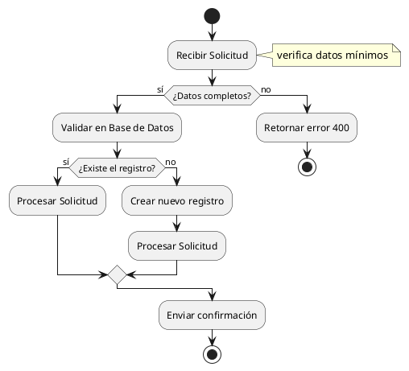
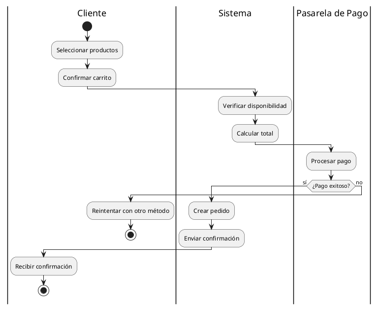
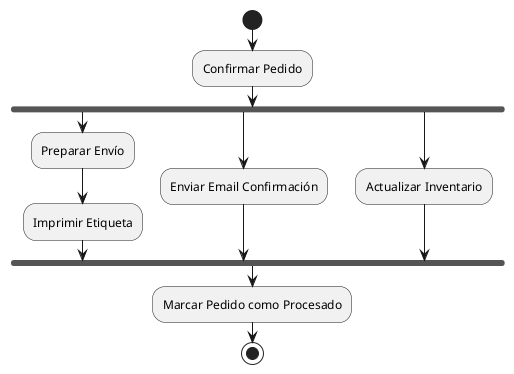
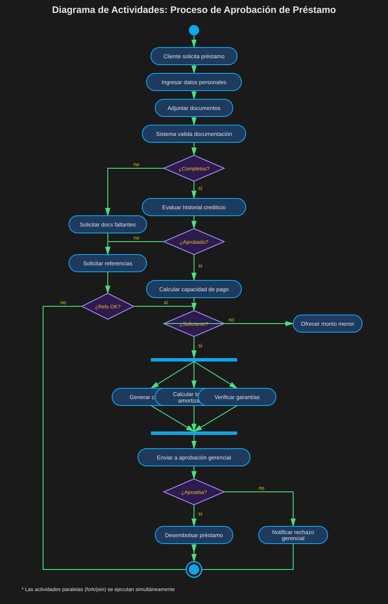
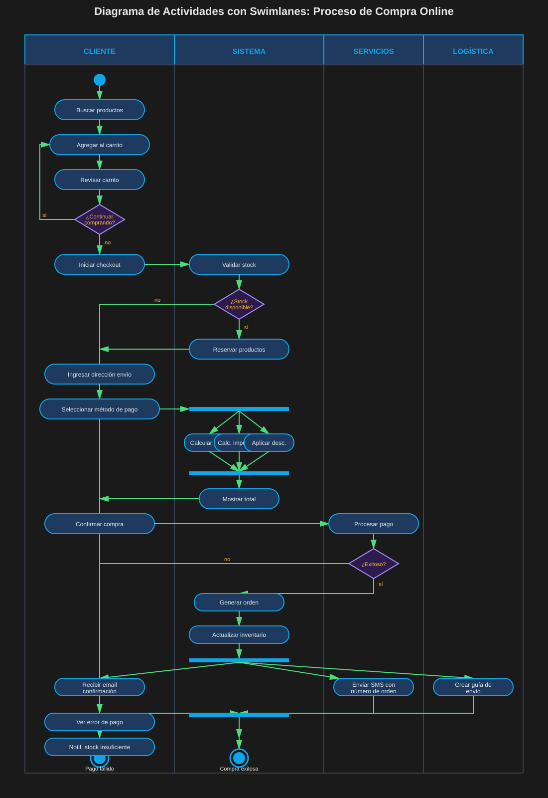

# 05 — Diagrama de Actividades

> ⏱️ Duración estimada: **20 minutos**

## 🎯 Objetivos

- Modelar flujos de proceso y workflows con diagramas de actividades
- Usar swimlanes para asignar responsabilidades
- Aplicar fork/join para modelar paralelismo
- Distinguir cuándo usar actividades vs estados

---

## 📖 ¿Qué es un Diagrama de Actividades?

El **Diagrama de Actividades** modela el **flujo de trabajo** de un proceso —
pasos secuenciales, decisiones y paralelismo. Similar a un flowchart pero con
semántica UML formal.

**Cuándo usarlo**:

- Documentar procesos de negocio complejos
- Modelar algoritmos con múltiples caminos
- Mostrar quién hace qué en un proceso (swimlanes)
- Identificar pasos paralelos que se pueden optimizar

---

## 🎨 Elementos del Diagrama

### Nodos Básicos

```
●         ← Inicio (nodo inicial)
┌───────┐
│ Acción │ ← Actividad/Acción
└───────┘
◆         ← Decisión / Bifurcación
───────── ← Barra de fork (inicia paralelo)
───────── ← Barra de join (sincroniza paralelo)
◉         ← Fin del flujo
```

### Sintaxis PlantUML



---

## 🏊 Swimlanes — Responsabilidades por Carril

Los swimlanes dividen el diagrama en **zonas de responsabilidad** para cada actor:



---

## 🔀 Fork y Join — Paralelismo

Fork inicia **múltiples flujos simultáneos**, Join los sincroniza:



---

## 🌍 Ejemplo: Proceso de Préstamo Bibliotecario



---

## 🌍 Ejemplo: Proceso de Compra Online



---

## 🆚 Estados vs Actividades — Diferencia Clave

| Criterio        | Diagrama de Estados            | Diagrama de Actividades       |
| --------------- | ------------------------------ | ----------------------------- |
| **Foco**        | Ciclo de vida de un objeto     | Flujo de un proceso           |
| **Unidad**      | Estado (condición estable)     | Actividad (acción a ejecutar) |
| **Pregunta**    | ¿En qué estado está el objeto? | ¿Qué pasos sigue el proceso?  |
| **Ejemplo**     | Ciclo de vida de un Pedido     | Proceso para tomar un Pedido  |
| **Paralelismo** | Raro (estados concurrentes)    | Común (fork/join)             |
| **Swimlanes**   | No se usa                      | Muy común                     |

---

## 🎯 Buenas Prácticas

```
✅ BIEN:
- Swimlanes cuando hay múltiples actores/sistemas involucrados
- Fork/join para operaciones que se pueden hacer en paralelo
- Notas para aclarar condiciones o reglas de negocio
- Nombres de actividades como verbos en forma de acción

❌ MAL:
- Diagrama sin swimlanes cuando hay 3+ actores
- Actividades con nombres ambiguos ("Procesar", "Hacer algo")
- Olvidar el nodo de fin (stop) en todos los caminos
- Mezclar nivel de abstracción (steps de sistema mezclados con pasos de usuario)
```

---

## ✅ Resumen

| Elemento       | Notación PlantUML                                  |
| -------------- | -------------------------------------------------- | ------------ | --- |
| Inicio         | `start`                                            |
| Actividad      | `:NombreActividad;`                                |
| Decisión       | `if (condición) then (sí) ... else (no) ... endif` |
| Fork inicio    | `fork`                                             |
| Fork siguiente | `fork again`                                       |
| Join           | `end fork`                                         |
| Swimlane       | `                                                  | NombreCarril | `   |
| Fin            | `stop`                                             |
| Nota           | `note right: texto`                                |

---

## 🔗 Navegación

⬅️ Anterior: [04 — Diagrama de Estados](04-estados.md) &nbsp;➡️ [Ir a Prácticas](../2-practicas/) | [Ir al Proyecto](../3-proyecto/)
