# 03 — Diagrama de Clases: Sintaxis y Estructura

> ⏱️ Duración estimada: **35 minutos**

## 🎯 Objetivos

- Dominar la sintaxis completa del diagrama de clases
- Aplicar correctamente los modificadores de visibilidad
- Modelar atributos, métodos y sus tipos
- Representar elementos especiales: abstractos, estáticos, derivados

---

## 🎥 Video de Refuerzo

📺 **El Plano del Código: UML**

👉 [Ver video en Dropbox](https://www.dropbox.com/scl/fi/7vr6zegwi3yjyeszafuy4/1.2.El_Plano_del_C-digo__UML.mp4?rlkey=nwtut0r1mhiue750jcav9cnnb&st=iweiu2fs&dl=0)

---

## 📖 ¿Qué es un Diagrama de Clases?

El **Diagrama de Clases** es el diagrama UML más utilizado. Representa la
**estructura estática** del sistema mostrando:

- **Clases**: Plantillas que definen objetos
- **Atributos**: Las propiedades/datos de cada clase
- **Métodos**: Los comportamientos/operaciones de cada clase
- **Relaciones**: Cómo se conectan las clases entre sí

---

## 🎨 Anatomía de una Clase

Una clase se representa con un rectángulo dividido en **3 compartimentos**:

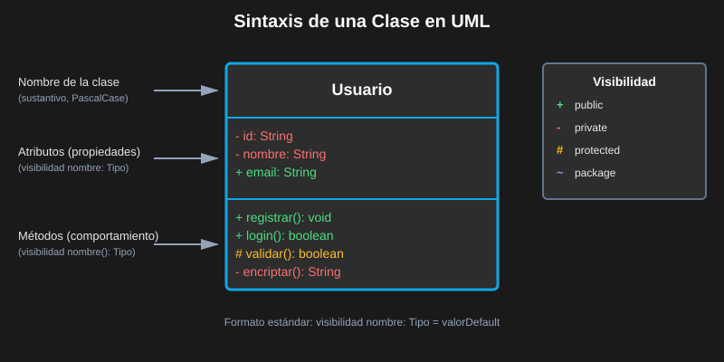

```
┌─────────────────────────────┐
│         NombreClase         │  ← Compartimento 1: Nombre (OBLIGATORIO)
├─────────────────────────────┤
│  visibilidad nombre: tipo   │  ← Compartimento 2: Atributos (opcional)
│  visibilidad nombre: tipo   │
├─────────────────────────────┤
│  visibilidad nombre(): tipo │  ← Compartimento 3: Métodos (opcional)
│  visibilidad nombre(): tipo │
└─────────────────────────────┘
```

### Ejemplo Completo

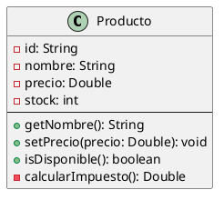

---

## 🔒 Modificadores de Visibilidad

Los modificadores de acceso se indican con **símbolos antes del nombre**:

| Símbolo | Visibilidad   | Significado                              | Equivalente                       |
| ------- | ------------- | ---------------------------------------- | --------------------------------- |
| `+`     | **public**    | Accesible desde cualquier lugar          | `public` en Java/Python           |
| `-`     | **private**   | Solo accesible desde la misma clase      | `private` en Java, `__` en Python |
| `#`     | **protected** | Accesible desde la clase y sus subclases | `protected` en Java               |
| `~`     | **package**   | Accesible dentro del mismo paquete       | `default` en Java                 |

### ✅ Buena Práctica: Encapsulamiento

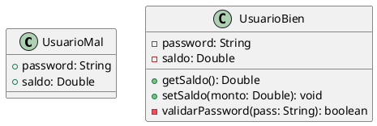

---

## 📝 Tipos de Atributos y Métodos

### Atributos con Tipo Explícito

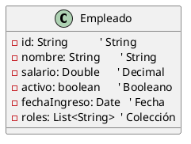

### Atributos Estáticos (subrayados)

Los atributos **estáticos** pertenecen a la clase, no a las instancias.
En PlantUML se subrayan automáticamente con `{static}`:

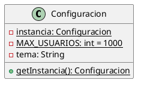

### Métodos Abstractos

Los métodos **abstractos** no tienen implementación — las subclases deben implementarlos:

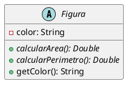

### Atributos Derivados (/)

Los atributos **derivados** se calculan a partir de otros:

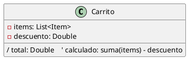

---

## 🏷️ Estereotipos y Restricciones

### Estereotipos Comunes

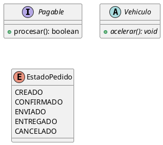

### Restricciones

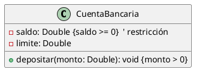

---

## 🌍 Ejemplo de la Vida Real: Sistema E-Commerce

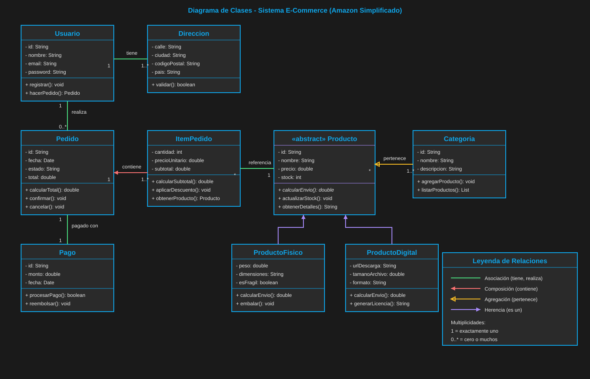

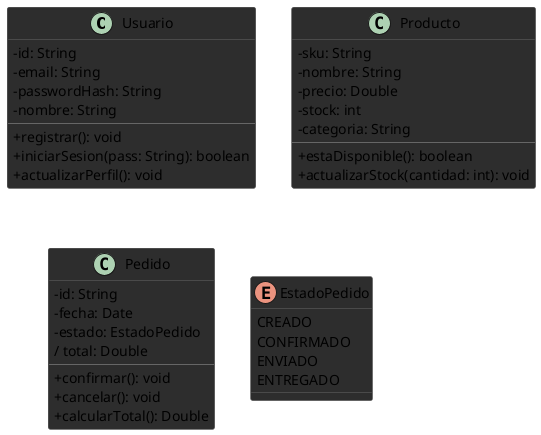

---

## ✅ Resumen

| Elemento           | Notación              | Cuándo usarlo                       |
| ------------------ | --------------------- | ----------------------------------- |
| Atributo público   | `+ nombre: Tipo`      | Raro — solo si es intencional       |
| Atributo privado   | `- nombre: Tipo`      | Por defecto para datos internos     |
| Atributo protegido | `# nombre: Tipo`      | Cuando subclases necesitan acceso   |
| Método público     | `+ nombre(): Tipo`    | API pública de la clase             |
| Atributo estático  | `{static} nombre`     | Compartido por todas las instancias |
| Método abstracto   | `{abstract} nombre()` | Clases abstractas/interfaces        |
| Atributo derivado  | `/ nombre: Tipo`      | Calculado a partir de otros         |

---

## 🔗 Navegación

⬅️ Anterior: [02 — Cuándo Usar UML](02-cuando-usar-uml.md) &nbsp;➡️ Siguiente: [04 — Relaciones entre Clases](04-relaciones-entre-clases.md)
