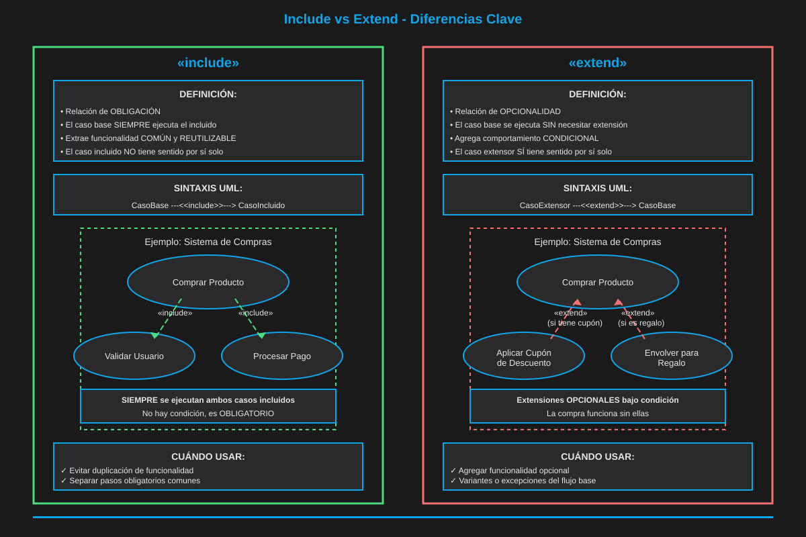
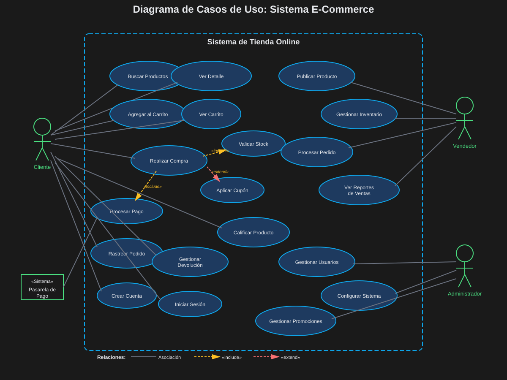
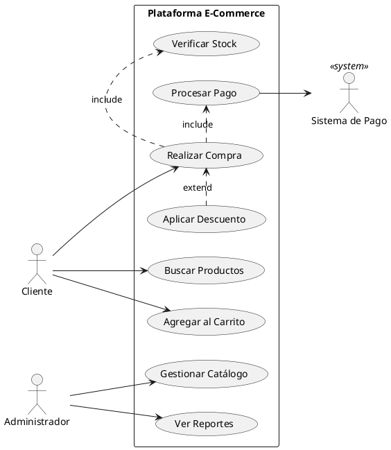

# 01 — Diagrama de Casos de Uso

> ⏱️ Duración estimada: **30 minutos**

## 🎯 Objetivos

- Dominar el diagrama más importante para la captura de requisitos
- Identificar actores y casos de uso en sistemas reales
- Aplicar relaciones include y extend correctamente
- Documentar casos de uso con especificaciones de texto

---

## 🎥 Video de Refuerzo

📺 **Diagramas de Casos de Uso**

👉 [Ver video en Dropbox](https://www.dropbox.com/scl/fi/7vg9h9m92nae9d55lye2p/2.1.Diagramas_de_Casos_de_Uso.mp4?rlkey=xts7ez1f6v4b7oj3z6x6uwdte&st=t4slm13b&dl=0)

---

## 📖 ¿Qué es un Diagrama de Casos de Uso?

El **Diagrama de Casos de Uso** responde la pregunta:

> **"¿Qué puede hacer el sistema?"** — desde la perspectiva del usuario.

Muestra:

- **Quién** interactúa con el sistema (actores)
- **Qué funcionalidades** ofrece el sistema (casos de uso)
- **Cómo** se relacionan esas funcionalidades entre sí

---

## 🎨 Elementos del Diagrama

### 1. Sistema (Límite / Boundary)

El rectángulo que delimita qué está **dentro** y qué está **fuera** del sistema:

```
 ··············································
 :                  Sistema                   :
 :    ╭──────╮   ╭──────────────────╮        :
 :    │  CU1 │   │       CU2        │        :
 :    ╰──────╯   ╰──────────────────╯        :
 ··············································
```

### 2. Actores

Entidades **externas** que interactúan con el sistema:

```
    👤              <<system>>
   ─────           🤖──────────
  "Cliente"        "PasarelaPago"
  (Primario)       (Secundario)
```

| Tipo           | Descripción              | Ejemplo                                    |
| -------------- | ------------------------ | ------------------------------------------ |
| **Primario**   | Usuario humano principal | Cliente, Administrador, Médico             |
| **Secundario** | Sistema externo          | API de pago, Servicio de email, BD externa |

### 3. Casos de Uso

Funcionalidad o servicio del sistema:

```
  ╭─────────────────╮
  │  Realizar Compra │   ← Verbo en infinitivo
  ╰─────────────────╯
```

**Reglas**:

- Siempre verbos en infinitivo: "Registrar Usuario", "Generar Reporte"
- Representan **objetivos del usuario**, no pasos técnicos
- Tienen valor desde la perspectiva del actor

---

## 🔗 Relaciones entre Casos de Uso

### Asociación Actor ↔ Caso de Uso

```
Cliente ────── (Realizar Compra)
```

### `«include»` — SIEMPRE incluye

El caso de uso base **siempre** invoca al caso de uso incluido.

```
(Realizar Compra) ─ ─ ─«include»─ ─ ─► (Verificar Stock)
```

**Analogía**: Como un import/require — siempre se ejecuta.

### `«extend»` — OPCIONALMENTE extiende

El caso de uso extensión **puede** ejecutarse bajo ciertas condiciones.

```
(Aplicar Descuento) ─ ─«extend»─ ─► (Realizar Compra)
```

**Analogía**: Como un plugin — se activa solo si se cumple la condición.

### `«generalization»` — Herencia de Actores

Un actor hereda todos los casos de uso de otro:

```
Administrador ──────▷ Usuario
```

---

## 🧠 include vs extend — La Diferencia Clave



| Criterio                   | `«include»`                     | `«extend»`                         |
| -------------------------- | ------------------------------- | ---------------------------------- |
| **¿Cuándo ocurre?**        | Siempre                         | Solo si se cumple una condición    |
| **¿Quién "usa" a quién?**  | CU base usa al incluido         | CU extensión enhances al base      |
| **Dirección de la flecha** | Base → Incluido                 | Extensión → Base                   |
| **Ejemplo**                | Login siempre verifica password | Descuento SOLO si hay cupón válido |

---

## 🌍 Ejemplo: Sistema E-Commerce





---

## 📝 Especificación de Caso de Uso (Texto)

Un diagrama de CU se complementa con **especificaciones textuales**:

```markdown
## CU-03: Realizar Compra

**Actor principal**: Cliente  
**Precondiciones**: Usuario autenticado, carrito con ítems  
**Postcondiciones**: Pedido creado, stock descontado, pago procesado

**Flujo Principal**:

1. El cliente confirma el carrito
2. El sistema verifica stock («include» CU-04)
3. El cliente selecciona método de pago
4. El sistema procesa el pago («include» CU-05)
5. El sistema crea el pedido
6. El sistema envía confirmación al cliente

**Flujo Alternativo** (A1: Pago rechazado):

1. El sistema notifica el rechazo
2. El cliente reintenta con otro método
```

---

## ✅ Resumen

| Elemento           | Uso                                  |
| ------------------ | ------------------------------------ |
| Actor primario     | Usuario que inicia la interacción    |
| Actor secundario   | Sistema externo involucrado          |
| `«include»`        | Funcionalidad siempre requerida      |
| `«extend»`         | Funcionalidad condicional u opcional |
| Límite del sistema | Delimita qué está dentro/fuera       |

---

## 🔗 Navegación

⬅️ [README Sesión 2](../README.md) &nbsp;➡️ Siguiente: [02 — Diagrama de Secuencia](02-secuencia.md)
