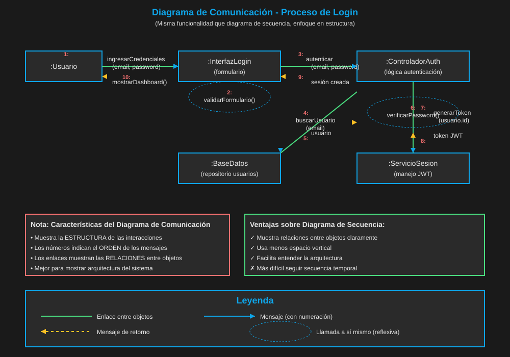
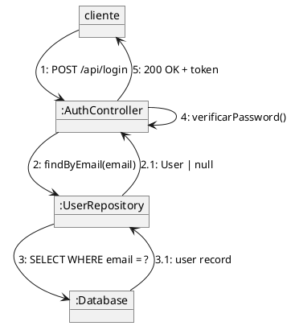

# 03 — Diagrama de Comunicación

> ⏱️ Duración estimada: **15 minutos**

## 🎯 Objetivos

- Entender el diagrama de comunicación como alternativa al de secuencia
- Identificar cuándo es más útil que el de secuencia
- Leer y crear diagramas de comunicación básicos

---

## 📖 ¿Qué es un Diagrama de Comunicación?

El **Diagrama de Comunicación** (antes llamado "colaboración") muestra las
mismas interacciones que el diagrama de secuencia, pero organizadas
**estructuralmente** (quién habla con quién) en lugar de temporalmente.

### Diferencia clave

| Aspecto        | Diagrama de Secuencia         | Diagrama de Comunicación                  |
| -------------- | ----------------------------- | ----------------------------------------- |
| **Foco**       | Orden temporal de mensajes    | Estructura de las interacciones           |
| **Fortaleza**  | Flujos con lógica compleja    | Ver qué objetos se comunican directamente |
| **Numeración** | Implícita (de arriba a abajo) | Explícita (1, 1.1, 2, 2.1...)             |
| **Uso**        | Diseño de flujos y APIs       | Análisis de acoplamiento entre clases     |

---

## 🎨 Elementos del Diagrama

### Notación básica

```
  ┌──────────┐      1: login(email, pass)     ┌──────────────┐
  │  cliente │ ─────────────────────────────► │ AuthController│
  └──────────┘ ◄────────────────────────────  └──────────────┘
                    1.1: return token
```

- Los objetos se conectan con líneas
- Los mensajes tienen **números de secuencia** para indicar el orden
- Los números anidados (1.1, 1.2, 2.1) indican llamadas dentro de una llamada

---

## 🌍 Ejemplo: Login (mismo flujo que secuencia)





---

## 🤔 ¿Cuándo usar cada uno?

```
¿Necesito ver el ORDEN y la LÓGICA del flujo?
  → Diagrama de SECUENCIA

¿Necesito ver QUIÉN SE COMUNICA con quién (estructura)?
  → Diagrama de COMUNICACIÓN

¿Tengo tanto tiempo real y estructura importantes?
  → Usa AMBOS (el de secuencia primero, comunicación como complemento)
```

---

## ✅ Resumen

- El diagrama de comunicación es semánticamente equivalente al de secuencia
- La diferencia es la perspectiva: temporal vs estructural
- En la práctica, el de secuencia es más usado (más claro para flujos complejos)
- El de comunicación es útil para analizar el acoplamiento entre objetos

---

## 🔗 Navegación

⬅️ Anterior: [02 — Diagrama de Secuencia](02-secuencia.md) &nbsp;➡️ Siguiente: [04 — Diagrama de Estados](04-estados.md)
