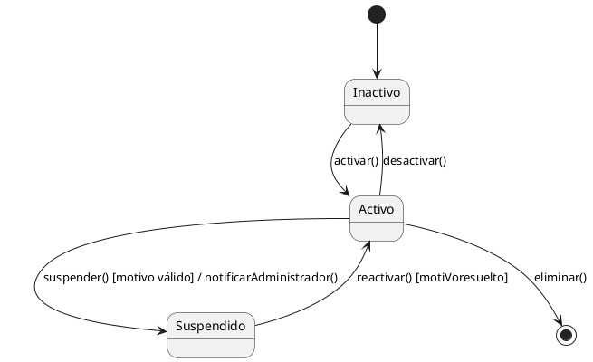
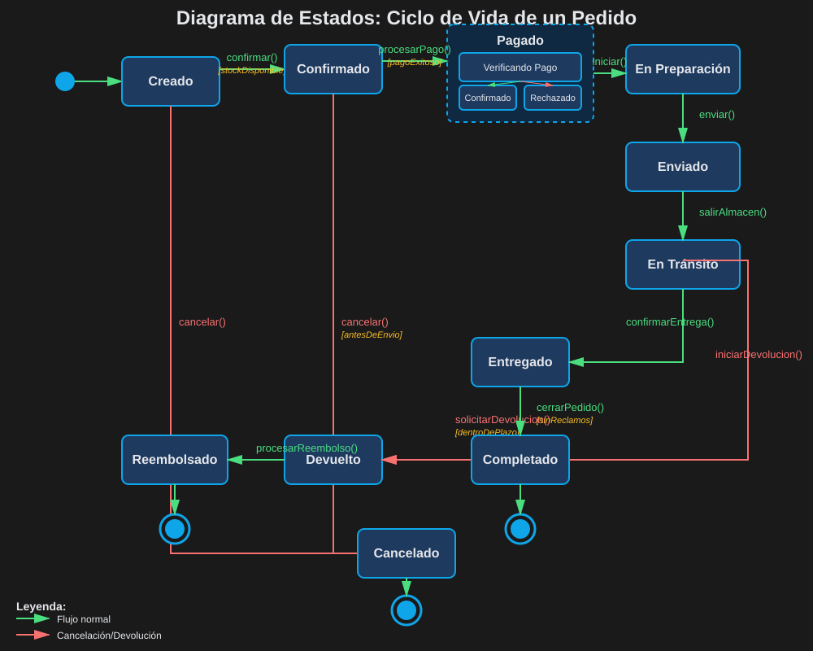
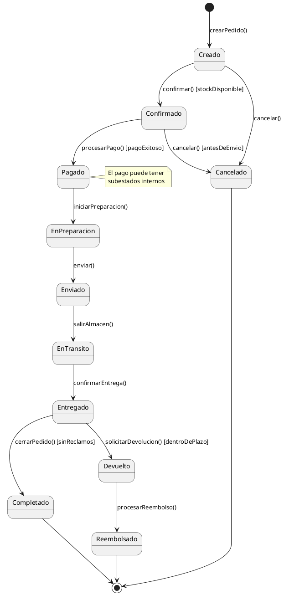
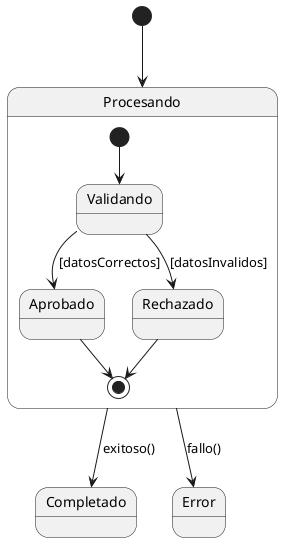

# 04 — Diagrama de Estados

> ⏱️ Duración estimada: **20 minutos**

## 🎯 Objetivos

- Modelar ciclos de vida de objetos con máquinas de estado
- Aplicar estados, transiciones, guardas y acciones
- Usar estados compuestos para modelar subestados
- Identificar objetos con ciclos de vida complejos

---

## 🎥 Video de Refuerzo

📺 **Duelo UML: Estado vs Actividad**

👉 [Ver video en Dropbox](https://www.dropbox.com/scl/fi/t4w417dh646uyx90fpbja/2.3.Duelo_UML__Estado_vs.mp4?rlkey=6bnjpdikcac5vzspzue0on119&st=4stttabv&dl=0)

---

## 📖 ¿Qué es un Diagrama de Estados?

El **Diagrama de Estados** (State Machine Diagram) muestra el **ciclo de vida**
de un objeto: todos los estados en los que puede encontrarse y los eventos
que lo hacen transitar entre ellos.

**Cuándo usarlo**:

- Objetos con comportamiento complejo que cambia según su estado (Pedido, Solicitud, Conexión)
- Reglas de negocio que restringen qué operaciones son válidas en cada estado
- Validación de flujos: ¿puede cancelarse un pedido ya enviado?

---

## 🎨 Elementos del Diagrama

### Estados, Inicial y Final

```
●         ← Estado inicial (punto negro lleno)
╔═══════╗
║ Estado ║ ← Estado simple
╚═══════╝
◉         ← Estado final (punto con borde)
```

### Transición

```
Estado1 ──evento [condición] / acción──► Estado2

Elementos:
  evento    — Lo que dispara la transición (obligatorio)
  [condición] — Guarda booleana (opcional)
  / acción  — Operación al transitar (opcional)
```

### Ejemplo básico



---

## 🌍 Ejemplo: Ciclo de Vida de un Pedido





---

## 🏗️ Estados Compuestos (Subestados)

Un estado puede tener su propia máquina de estados interna:



---

## 🎯 Buenas Prácticas

| ✅ BIEN                                             | ❌ MAL                                 |
| --------------------------------------------------- | -------------------------------------- |
| Estados con nombres claros: `EnProceso`, `Aprobado` | Estados ambiguos: `Estado1`, `Proceso` |
| Transiciones con eventos explícitos                 | Flechas sin etiquetas                  |
| Incluir estados de error y cancelación              | Solo modelar el "happy path"           |
| Máximo 10-12 estados principales                    | Diagramas con 20+ estados planos       |
| Guardas para transiciones condicionales             | Multiples flechas sin condiciones      |

---

## ✅ Resumen

| Elemento         | Notación                       |
| ---------------- | ------------------------------ |
| Estado inicial   | `●` o `[*] -->`                |
| Estado normal    | cuadro o `Estado`              |
| Estado final     | `◉` o `--> [*]`                |
| Transición       | `Estado1 --> Estado2 : evento` |
| Guarda           | `[condición]` en la transición |
| Acción           | `/ acción()` en la transición  |
| Estado compuesto | `state X { ... }`              |

---

## 🔗 Navegación

⬅️ Anterior: [03 — Diagrama de Comunicación](03-comunicacion.md) &nbsp;➡️ Siguiente: [05 — Diagrama de Actividades](05-actividades.md)
