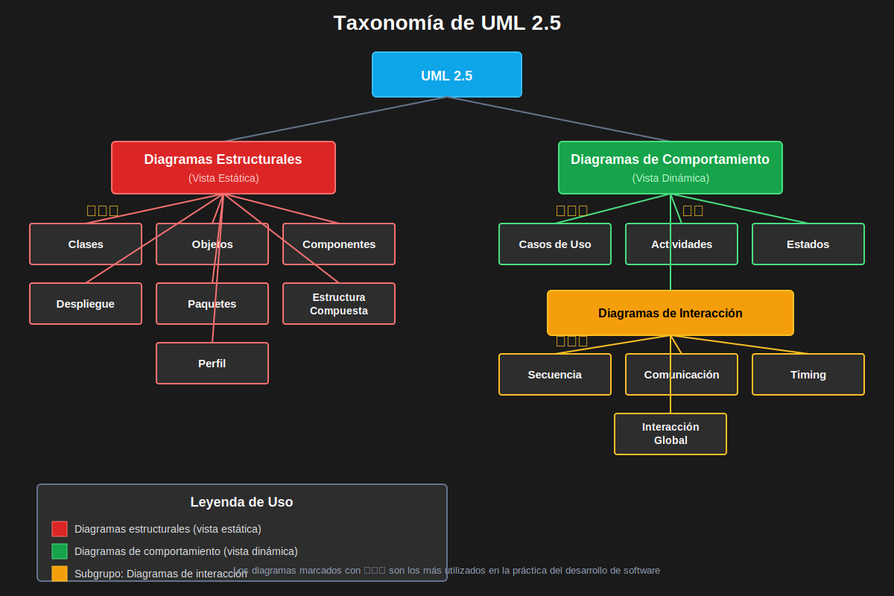
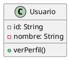

# Módulo 1.1: Introducción a UML

## ⏱️ Duración: 1 hora

## 🎯 Objetivos del Módulo

- Comprender qué es UML y por qué es importante
- Conocer la historia y evolución de UML
- Identificar los diferentes tipos de diagramas
- Entender cuándo y cómo usar UML en proyectos reales

---

## 🎥 Video de Refuerzo

📺 **UML: El Plano para el Software**

👉 [Ver video en Dropbox](https://www.dropbox.com/scl/fi/a56f6rip3ez3ez1oe3evh/1.1.UML__El_Plano_para_el_Software.mp4?rlkey=p4noshv6t8whdua59fafnrar6&st=ab1ia0hz&dl=0)

Este video complementa los conceptos fundamentales de UML presentados en este módulo.

---

## 📖 ¿Qué es UML?

**UML (Unified Modeling Language)** es un lenguaje de modelado visual estandarizado para:

- **Especificar**: Definir estructuras y comportamientos de sistemas
- **Visualizar**: Representar gráficamente el diseño del software
- **Construir**: Guiar la implementación del código
- **Documentar**: Crear documentación técnica comprensible

### 🏛️ Historia de UML

```
1994 ─┬─ Grady Booch (Método Booch)
      ├─ James Rumbaugh (OMT)
      └─ Ivar Jacobson (OOSE)
         │
         ▼
1997 ─── UML 1.0 (Adoptado por OMG)
         │
         ▼
2005 ─── UML 2.0 (Versión mayor)
         │
         ▼
2017 ─── UML 2.5.1 (Versión actual)
```

---

## 📊 Tipos de Diagramas UML

UML 2.5 define **14 tipos de diagramas** divididos en dos categorías principales:

### 1️⃣ Diagramas Estructurales (Static)

Representan la estructura estática del sistema.

| Diagrama                 | Propósito                                     | Uso Principal      |
| ------------------------ | --------------------------------------------- | ------------------ |
| **Clases**               | Estructura de clases y relaciones             | Diseño OOP         |
| **Objetos**              | Instancias de clases en un momento específico | Ejemplos concretos |
| **Componentes**          | Organización de módulos del sistema           | Arquitectura       |
| **Despliegue**           | Distribución física del sistema               | Infraestructura    |
| **Paquetes**             | Agrupación lógica de elementos                | Organización       |
| **Estructura Compuesta** | Estructura interna de una clase               | Diseño avanzado    |
| **Perfil**               | Extensiones de UML                            | Personalización    |

### 2️⃣ Diagramas de Comportamiento (Dynamic)

Representan el comportamiento dinámico del sistema.

| Diagrama               | Propósito                                     | Uso Principal           |
| ---------------------- | --------------------------------------------- | ----------------------- |
| **Casos de Uso**       | Funcionalidades desde perspectiva del usuario | Requisitos              |
| **Secuencia**          | Interacciones entre objetos en el tiempo      | Flujos detallados       |
| **Comunicación**       | Interacciones entre objetos estructuralmente  | Colaboración            |
| **Estados**            | Ciclo de vida de un objeto                    | Máquinas de estado      |
| **Actividades**        | Flujo de procesos y actividades               | Procesos de negocio     |
| **Timing**             | Restricciones temporales                      | Sistemas en tiempo real |
| **Interacción Global** | Combinación de interacciones                  | Flujos complejos        |

---

## 🎨 Diagrama Visual: Taxonomía de UML



---

## 💡 ¿Cuándo usar UML?

### ✅ Situaciones Ideales para UML

1. **Proyectos Complejos**

   - Múltiples desarrolladores
   - Arquitecturas sofisticadas
   - Necesidad de documentación

2. **Comunicación del Equipo**

   - Alinear visión del sistema
   - Onboarding de nuevos miembros
   - Revisiones de diseño

3. **Planificación Arquitectónica**

   - Diseño antes de implementar
   - Evaluación de alternativas
   - Prevención de problemas

4. **Documentación de Sistemas Existentes**
   - Ingeniería inversa
   - Mantenimiento de legados
   - Transferencia de conocimiento

### ❌ Cuándo NO usar UML (o usar con moderación)

1. **Proyectos Pequeños y Simples**

   - Overhead innecesario
   - Mejor ir directo al código

2. **Equipos con Metodologías Ágiles Extremas**

   - Preferencia por código sobre documentación
   - Cambios muy frecuentes

3. **Prototipos Rápidos**
   - Foco en experimentación
   - Descarte esperado

---

## 🎯 Buenas Prácticas Generales

### 1. **Simplicidad**

```
❌ MAL: Incluir todos los detalles posibles
✅ BIEN: Modelar solo lo necesario para comunicar la idea
```

### 2. **Audiencia**

```
❌ MAL: Usar el mismo nivel de detalle para todos
✅ BIEN: Adaptar el diagrama según quién lo va a leer
```

### 3. **Actualización**

```
❌ MAL: Crear diagramas y olvidarlos
✅ BIEN: Mantener diagramas clave sincronizados con el código
```

### 4. **Herramientas**

```
❌ MAL: Diagramas en herramientas propietarias no accesibles
✅ BIEN: Usar formatos estándar y accesibles (PlantUML, SVG)
```

### 5. **Consistencia**

```
❌ MAL: Diferentes estilos en cada diagrama
✅ BIEN: Mantener convenciones consistentes en todo el proyecto
```

---

## 🌍 Ejemplo de la Vida Real: Netflix

### Problema

Netflix necesita diseñar su sistema de recomendaciones que involucra:

- Millones de usuarios
- Miles de películas y series
- Algoritmos complejos de ML
- Múltiples equipos trabajando en paralelo

### Solución con UML

1. **Diagrama de Casos de Uso**: Definir funcionalidades (ver contenido, recibir recomendaciones, calificar)
2. **Diagrama de Clases**: Modelar Usuario, Contenido, Recomendación, Calificación
3. **Diagrama de Secuencia**: Mostrar el flujo de "generar recomendaciones"
4. **Diagrama de Componentes**: Arquitectura de microservicios
5. **Diagrama de Despliegue**: Distribución en AWS

### Resultado

- Comunicación clara entre equipos
- Documentación arquitectónica
- Detección temprana de problemas de diseño
- Facilita la escalabilidad

---

## 🔧 Herramientas para Trabajar con UML

### 1. **PlantUML** (Recomendado para este curso)



**Ventajas**: Texto plano, control de versiones, automatización

### 2. **Draw.io**

- Interfaz visual intuitiva
- Gratuito y web-based
- Exporta a múltiples formatos

### 3. **Visual Paradigm**

- Suite profesional completa
- Ingeniería directa e inversa
- Versión community gratuita

### 4. **Lucidchart**

- Colaboración en tiempo real
- Plantillas predefinidas
- Integración con Google Drive

---

## 📝 Ejercicio 1: Identificar Diagramas (15 min)

Para cada escenario, identifica qué tipo(s) de diagrama UML serían más apropiados:

1. **Escenario A**: Necesitas mostrar cómo un cliente realiza una compra en una tienda online.

   - Respuesta: **\*\***\_\_\_**\*\***

2. **Escenario B**: Quieres documentar las clases principales de tu aplicación de gestión de tareas.

   - Respuesta: **\*\***\_\_\_**\*\***

3. **Escenario C**: Necesitas explicar los diferentes estados por los que pasa un pedido (pendiente, procesando, enviado, entregado).

   - Respuesta: **\*\***\_\_\_**\*\***

4. **Escenario D**: Debes mostrar cómo se distribuyen los servicios de tu aplicación en diferentes servidores.
   - Respuesta: **\*\***\_\_\_**\*\***

**Respuestas**:

1. Diagrama de Casos de Uso + Diagrama de Secuencia
2. Diagrama de Clases
3. Diagrama de Estados
4. Diagrama de Despliegue

---

## 📚 Recursos Adicionales

- [UML Specification - OMG](https://www.omg.org/spec/UML/)
- [PlantUML Documentation](https://plantuml.com/)
- Libro: "UML Distilled" - Martin Fowler
- [UML Cheat Sheet](https://www.visual-paradigm.com/guide/uml-unified-modeling-language/uml-cheat-sheet/)

---

## ✅ Checklist del Módulo

Antes de continuar, asegúrate de:

- [ ] Comprender qué es UML y su propósito
- [ ] Conocer los 14 tipos de diagramas
- [ ] Identificar cuándo usar cada diagrama
- [ ] Entender las buenas prácticas básicas
- [ ] Haber completado el ejercicio 1

---

## ⏭️ Siguiente Módulo

[Módulo 1.2: Diagrama de Clases](./modulo-1.2-diagrama-clases.md)
