# Módulo 1.2: Diagrama de Clases

## ⏱️ Duración: 1.5 horas

## 🎯 Objetivos del Módulo

- Dominar la sintaxis del diagrama de clases
- Comprender los diferentes tipos de relaciones
- Aplicar principios de diseño orientado a objetos
- Crear diagramas de clases para casos reales

---

## 🎥 Video de Refuerzo

📺 **El Plano del Código: UML**

👉 [Ver video en Dropbox](https://www.dropbox.com/scl/fi/7vr6zegwi3yjyeszafuy4/1.2.El_Plano_del_C-digo__UML.mp4?rlkey=nwtut0r1mhiue750jcav9cnnb&st=iweiu2fs&dl=0)

Este video complementa los conceptos de diagramas de clases y relaciones presentados en este módulo.

---

## 📖 ¿Qué es un Diagrama de Clases?

El **Diagrama de Clases** es el diagrama más utilizado en UML. Representa la estructura estática del sistema mostrando:

- **Clases**: Plantillas de objetos
- **Atributos**: Propiedades de las clases
- **Métodos**: Comportamientos de las clases
- **Relaciones**: Cómo se conectan las clases entre sí

---

## 🎨 Sintaxis Básica: La Clase

Una clase se representa con un rectángulo dividido en 3 compartimentos:

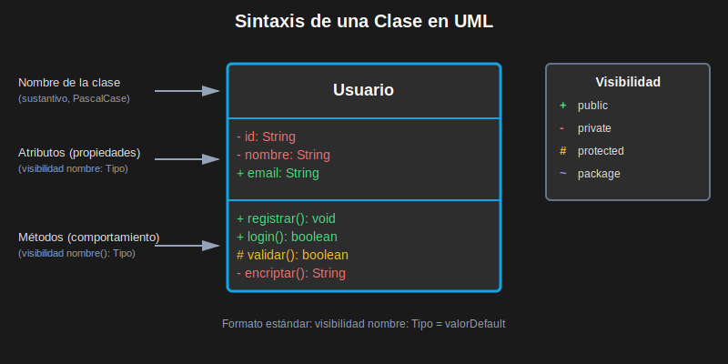

### Estructura de una Clase

```
┌─────────────────────────┐
│      Nombre             │  ← Compartimento 1: Nombre
├─────────────────────────┤
│      Atributos          │  ← Compartimento 2: Atributos
├─────────────────────────┤
│      Métodos            │  ← Compartimento 3: Métodos
└─────────────────────────┘
```

### Ejemplo Completo

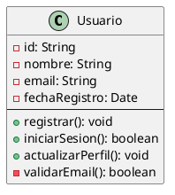

---

## 🔒 Visibilidad de Miembros

Los modificadores de acceso se indican con símbolos:

| Símbolo | Visibilidad   | Significado                          | Ejemplo                 |
| ------- | ------------- | ------------------------------------ | ----------------------- |
| `+`     | **public**    | Accesible desde cualquier lugar      | `+ getNombre(): String` |
| `-`     | **private**   | Solo accesible desde la misma clase  | `- password: String`    |
| `#`     | **protected** | Accesible desde la clase y subclases | `# validar(): boolean`  |
| `~`     | **package**   | Accesible dentro del mismo paquete   | `~ configurar(): void`  |

### 📌 Buena Práctica: Encapsulamiento

```
❌ MAL:
class Usuario {
  + password: String
  + saldo: Double
}

✅ BIEN:
class Usuario {
  - password: String
  - saldo: Double
  + getPassword(): String
  + setSaldo(monto: Double): void
}
```

---

## 🎯 Tipos de Atributos y Métodos

### Atributos Estáticos (Subrayados)

```
Usuario
─────────────────
- contadorUsuarios: int  ← estático
- nombre: String
```

### Métodos Abstractos (Cursiva o {abstract})

```
«abstract» Animal
─────────────────
+ emitirSonido(): void {abstract}
```

### Atributos Derivados (/)

```
Producto
─────────────────
- precio: Double
- descuento: Double
/ precioFinal: Double  ← calculado
```

---

## 🔗 Tipos de Relaciones entre Clases

UML define 6 tipos principales de relaciones entre clases:

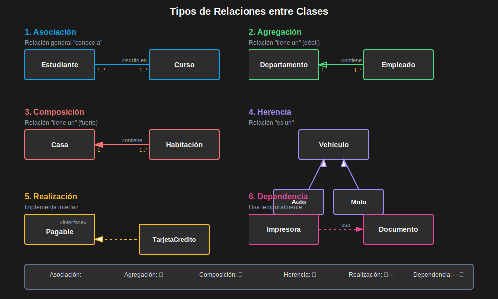

### 1️⃣ **Asociación** (Línea simple)

Relación general entre dos clases.

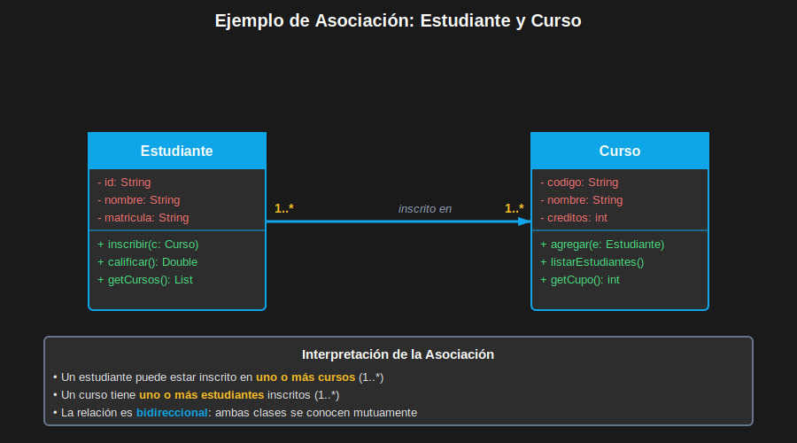

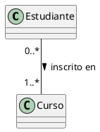

**Multiplicidad**:

- `1` : Exactamente uno
- `0..1` : Cero o uno (opcional)
- `0..*` o `*` : Cero o muchos
- `1..*` : Uno o muchos
- `2..5` : Entre 2 y 5

### 2️⃣ **Agregación** (Diamante blanco)

Relación "tiene un" donde las partes pueden existir independientemente.

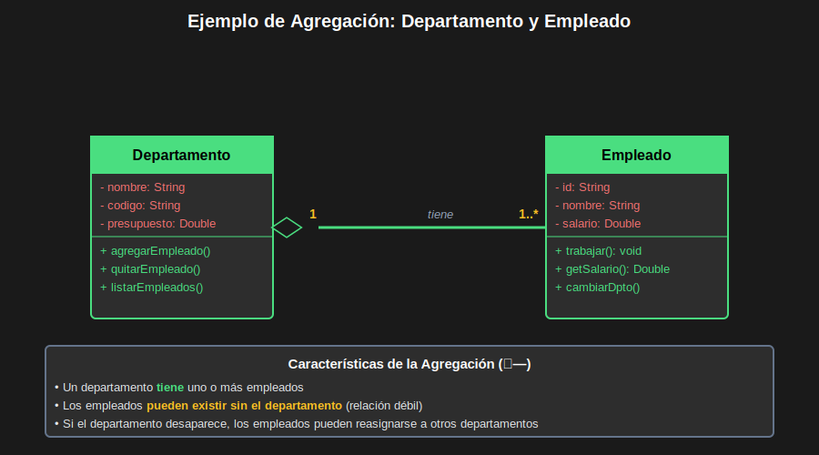

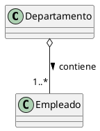

**Ejemplo**: Un departamento tiene empleados, pero los empleados pueden existir sin el departamento.

### 3️⃣ **Composición** (Diamante negro)

Relación "tiene un" donde las partes NO pueden existir sin el todo.

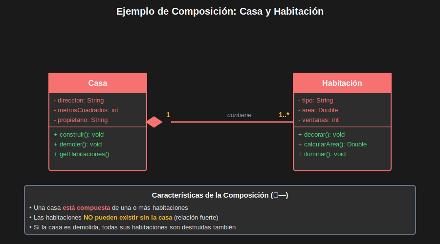

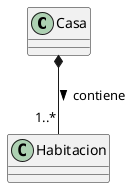

**Ejemplo**: Una casa tiene habitaciones, si destruyes la casa, las habitaciones dejan de existir.

### 4️⃣ **Herencia/Generalización** (Flecha con triángulo blanco)

Relación "es un" donde una clase hereda de otra.

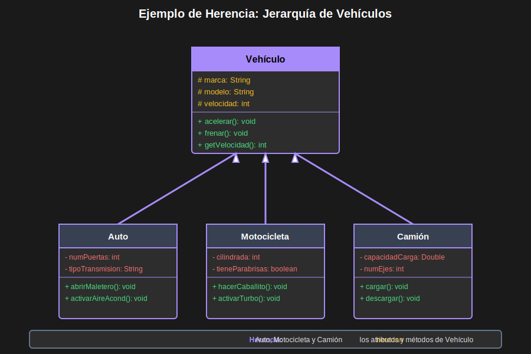

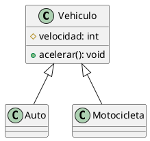

### 5️⃣ **Realización/Implementación** (Flecha discontinua con triángulo)

Una clase implementa una interfaz.

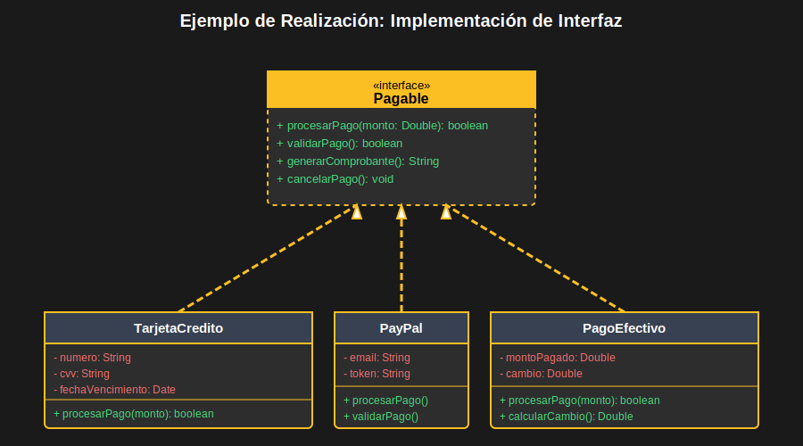

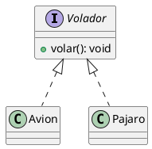

### 6️⃣ **Dependencia** (Flecha discontinua)

Una clase usa temporalmente otra clase.

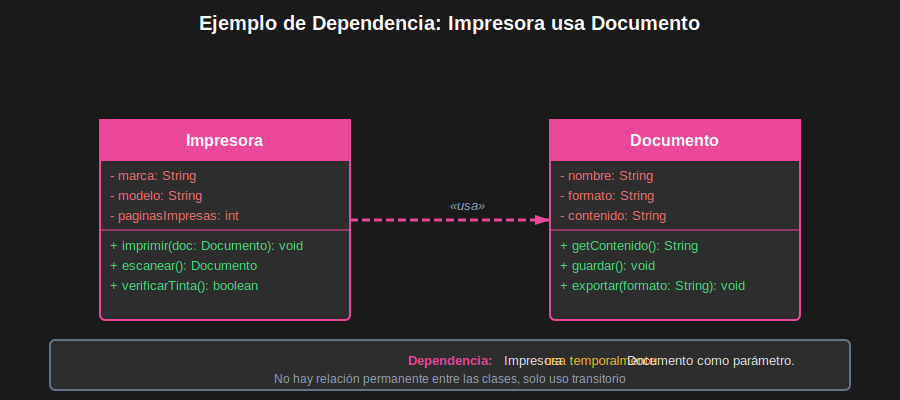

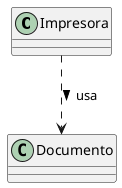

---

## 📊 Comparación de Relaciones

| Relación    | Símbolo | Fuerza     | Ejemplo                         |
| ----------- | ------- | ---------- | ------------------------------- |
| Dependencia | `..>`   | Muy débil  | Método usa clase como parámetro |
| Asociación  | `--`    | Débil      | Cliente tiene dirección         |
| Agregación  | `o--`   | Media      | Equipo tiene jugadores          |
| Composición | `*--`   | Fuerte     | Pedido tiene ítems              |
| Herencia    | `<\|--` | Muy fuerte | Perro es Animal                 |

---

## 🌍 Ejemplo de la Vida Real: Sistema de E-Commerce

### Caso: Amazon Simplificado

**Requisitos**:

- Los usuarios pueden hacer pedidos
- Los pedidos contienen productos
- Los usuarios tienen dirección de envío
- Hay diferentes tipos de productos (físicos, digitales)
- Los productos pertenecen a categorías

### Diagrama de Clases

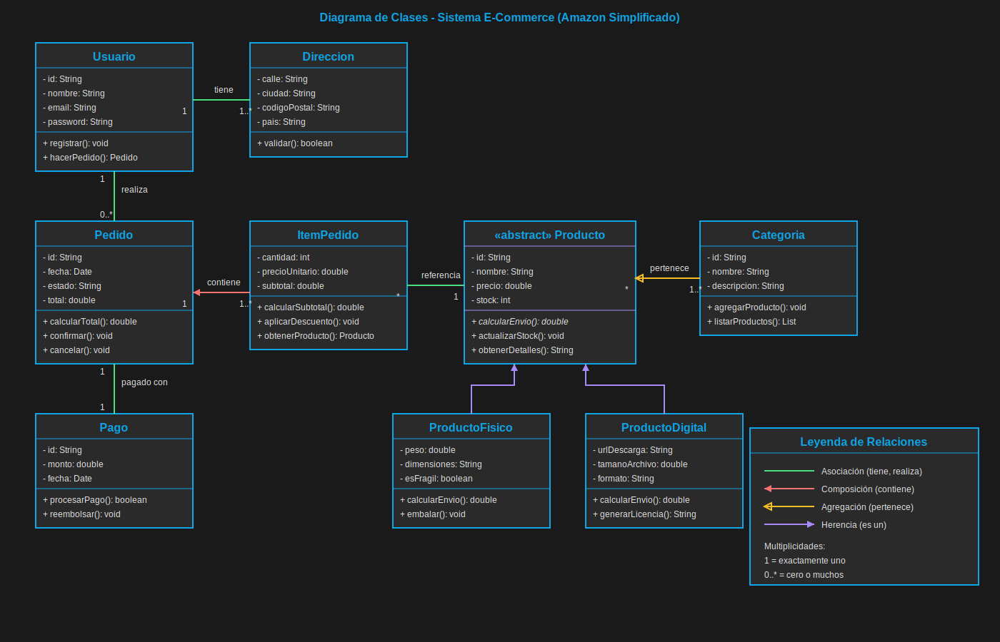

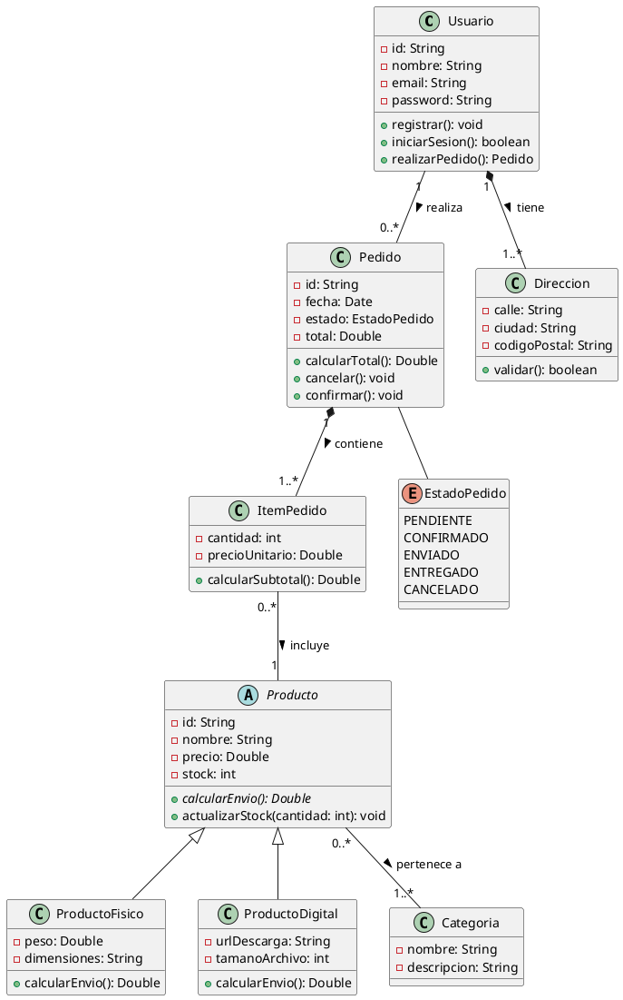

### Análisis del Diagrama

1. **Composición** (Pedido-ItemPedido): Los ítems no existen sin el pedido
2. **Agregación** (Usuario-Dirección): La dirección puede existir independientemente
3. **Herencia** (Producto): ProductoFisico y ProductoDigital heredan de Producto
4. **Asociación** (Usuario-Pedido): Relación simple entre usuarios y pedidos
5. **Enumeración** (EstadoPedido): Define estados posibles del pedido

---

## 🎯 Buenas Prácticas en Diagramas de Clases

### 1. **Nombres Significativos**

```
❌ MAL: class A, class B, class Manager
✅ BIEN: class Usuario, class Pedido, class GestorInventario
```

### 2. **Nivel de Detalle Apropiado**

```
❌ MAL: Incluir todos los getters/setters
✅ BIEN: Mostrar solo métodos importantes para el diseño
```

### 3. **Evitar Relaciones Redundantes**

```
❌ MAL: Si A→B→C, no agregar A→C
✅ BIEN: Solo relaciones directas necesarias
```

### 4. **Usar Interfaces para Flexibilidad**

```
✅ BIEN:
interface Pagable {
  + procesarPago(): boolean
}
class TarjetaCredito implements Pagable
class PayPal implements Pagable
```

### 5. **Aplicar Principios SOLID**

- **S**ingle Responsibility: Una clase, una responsabilidad
- **O**pen/Closed: Abierto a extensión, cerrado a modificación
- **L**iskov Substitution: Las subclases deben ser sustituibles
- **I**nterface Segregation: Interfaces específicas, no generales
- **D**ependency Inversion: Depender de abstracciones

---

## 📝 Ejercicio 2: Sistema Bancario (30 min)

### Requisitos

Diseña un diagrama de clases para un sistema bancario con:

1. **Clientes** que tienen cuentas bancarias
2. **Cuentas** de dos tipos: Ahorro y Corriente
3. Las cuentas tienen **transacciones**
4. Las transacciones pueden ser: Depósito, Retiro, Transferencia
5. Los clientes tienen una **dirección**
6. Las cuentas pertenecen a una **sucursal**

### Especificaciones

- Cuenta Ahorro: tiene tasa de interés, límite de retiros mensuales
- Cuenta Corriente: tiene sobregiro permitido, cobra comisión
- Transferencia: requiere cuenta origen y destino
- Cliente: puede tener múltiples cuentas

### Entregable

Crea el diagrama de clases completo con:

- Todas las clases necesarias
- Atributos principales (con visibilidad)
- Métodos clave
- Relaciones apropiadas con multiplicidad

**Solución**: Ver [solucion-ejercicio-2.md](./ejercicios/solucion-ejercicio-2.md)

---

## 🔍 Patrones de Diseño Comunes

### Patrón Singleton

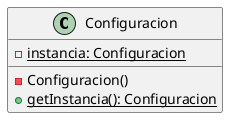

### Patrón Factory

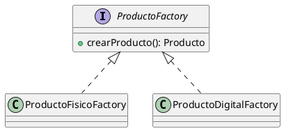

### Patrón Observer

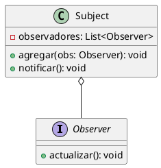

---

## ✅ Checklist del Módulo

Antes de continuar, asegúrate de:

- [ ] Dominar la sintaxis de una clase
- [ ] Conocer todos los tipos de relaciones
- [ ] Saber cuándo usar cada relación
- [ ] Aplicar buenas prácticas de diseño
- [ ] Haber completado el ejercicio 2

---

## ⏭️ Siguiente Módulo

[Módulo 1.3: Diagramas Estructurales](./modulo-1.3-diagramas-estructurales.md)
