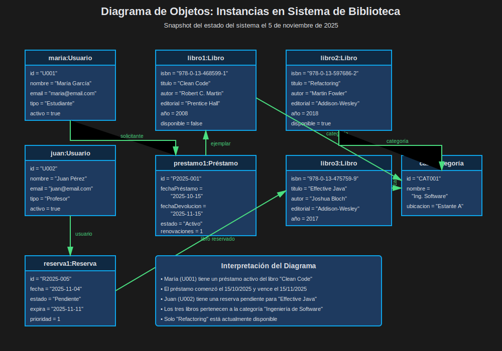
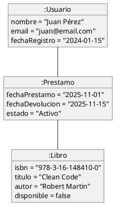
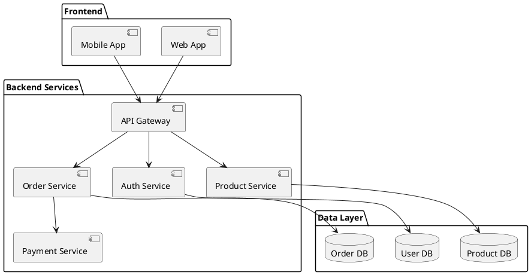
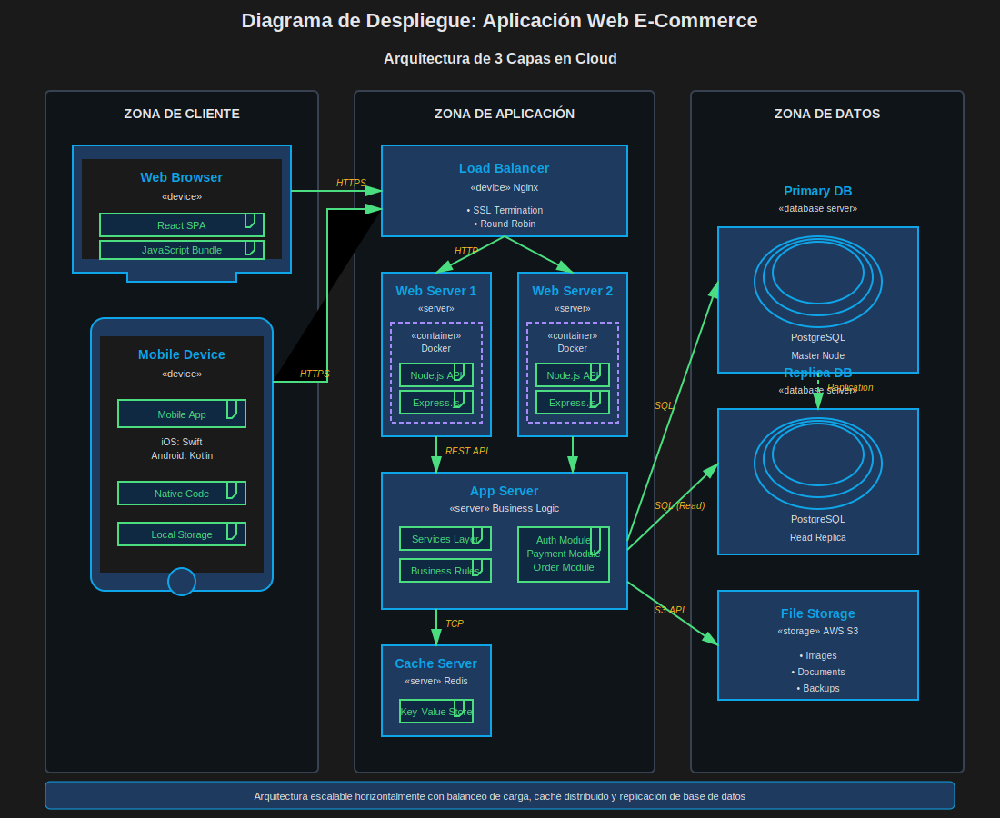
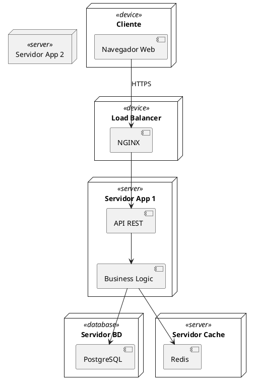

# Módulo 1.3: Diagramas Estructurales Complementarios

## ⏱️ Duración: 1 hora

## 🎯 Objetivos del Módulo

- Conocer otros diagramas estructurales importantes
- Comprender cuándo usar cada diagrama
- Aplicar diagramas de objetos, componentes y despliegue
- Diferenciar entre diagramas estáticos y sus usos

---

## 📖 Introducción

Además del **Diagrama de Clases** (el más usado), UML ofrece otros diagramas estructurales que complementan el análisis de sistemas. En este módulo nos enfocaremos en los más relevantes para el análisis de sistemas:

1. **Diagrama de Objetos** - Para ejemplificar instancias concretas
2. **Diagrama de Componentes** - Para arquitectura de software
3. **Diagrama de Despliegue** - Para infraestructura física

---

## 1️⃣ Diagrama de Objetos

### ¿Qué es?

El **Diagrama de Objetos** muestra instancias específicas de clases en un momento determinado. Es como una "fotografía" del sistema en ejecución.

### 🎯 Cuándo usarlo

✅ **Usar cuando**:

- Necesitas ejemplificar un diagrama de clases complejo
- Quieres mostrar datos de prueba o ejemplos
- Necesitas documentar un estado específico del sistema
- Validar el diseño con datos reales

### Sintaxis

```
┌─────────────────────────┐
│  nombreObjeto: Clase    │  ← Objeto subrayado
├─────────────────────────┤
│  atributo1 = valor1     │  ← Valores concretos
│  atributo2 = valor2     │
└─────────────────────────┘
```

### 🌍 Ejemplo: Sistema de Biblioteca



**Caso**: Mostrar el estado actual de préstamos en una biblioteca



### 💡 Buenas Prácticas

```
✅ BIEN:
- Usar para complementar diagramas de clases
- Mostrar casos de ejemplo realistas
- Validar multiplicidades

❌ MAL:
- Usar como sustituto del diagrama de clases
- Incluir demasiados objetos
- Mostrar lógica de negocio
```

---

## 2️⃣ Diagrama de Componentes

### ¿Qué es?

El **Diagrama de Componentes** muestra la organización y dependencias entre componentes de software (módulos, servicios, bibliotecas, etc.).

### 🎯 Cuándo usarlo (MUY COMÚN en Análisis de Sistemas)

✅ **Usar cuando**:

- Diseñas arquitectura de microservicios
- Defines módulos del sistema
- Documentas dependencias entre subsistemas
- Planificas integración de sistemas

### Notación Básica

```
┌──────┐
│      │
│  📦  │  ← Componente
│      │
└──────┘

  ↓ provee
  ⚪ interfaz requerida
  ⚫ interfaz provista
```

### 🌍 Ejemplo Real: Sistema E-Commerce




### 📊 Ejemplo: Netflix (Arquitectura Simplificada)

**Componentes principales**:

- **Content Delivery**: Streaming de video
- **Recommendation Engine**: Sistema de recomendaciones
- **User Management**: Gestión de usuarios
- **Billing Service**: Facturación
- **Analytics**: Análisis de datos

**Ventajas**:

- Escalabilidad independiente
- Despliegue independiente
- Mantenibilidad mejorada
- Equipos especializados

### 💡 Buenas Prácticas

```
✅ BIEN:
- Agrupar componentes relacionados en paquetes
- Mostrar interfaces claramente
- Indicar dependencias importantes
- Usar capas (presentación, lógica, datos)

❌ MAL:
- Mezclar niveles de abstracción
- Incluir detalles de implementación
- Mostrar todas las dependencias posibles
```

---

## 3️⃣ Diagrama de Despliegue

### ¿Qué es?

El **Diagrama de Despliegue** muestra la arquitectura física del sistema: servidores, dispositivos, redes y cómo se distribuyen los componentes.

### 🎯 Cuándo usarlo (IMPORTANTE en Análisis de Sistemas)

✅ **Usar cuando**:

- Planificas infraestructura
- Defines arquitectura cloud
- Documentas entorno de producción
- Evalúas escalabilidad y rendimiento

### Notación

```
┌─────────────┐
│  <<device>> │  ← Nodo físico
│   Servidor  │
└─────────────┘
      ↕
  Comunicación
```

### 🌍 Ejemplo Real: Aplicación Web Típica





### 📊 Ejemplo Cloud: AWS Deployment

**Caso**: Aplicación en Amazon Web Services

```
┌─────────────────────────────────────┐
│         AWS Cloud                   │
│  ┌────────────────────────────┐    │
│  │  VPC (Red Virtual)          │    │
│  │  ┌──────────┐  ┌──────────┐│    │
│  │  │   EC2    │  │   EC2    ││    │
│  │  │ Instance │  │ Instance ││    │
│  │  └──────────┘  └──────────┘│    │
│  │        ↓            ↓        │    │
│  │     ┌─────────────────┐     │    │
│  │     │   RDS Database  │     │    │
│  │     └─────────────────┘     │    │
│  │     ┌─────────────────┐     │    │
│  │     │   S3 Storage    │     │    │
│  │     └─────────────────┘     │    │
│  └────────────────────────────┘    │
└─────────────────────────────────────┘
```

### 💡 Buenas Prácticas

```
✅ BIEN:
- Mostrar redundancia y alta disponibilidad
- Indicar protocolos de comunicación
- Documentar configuración de seguridad
- Especificar capacidades (CPU, RAM)

❌ MAL:
- Mezclar lógica de negocio con infraestructura
- Omitir aspectos de seguridad
- No considerar escalabilidad
```

---

## 📊 Comparativa: ¿Cuándo usar cada diagrama?

| Diagrama        | Propósito                       | Nivel           | Usado en Análisis   |
| --------------- | ------------------------------- | --------------- | ------------------- |
| **Clases**      | Diseño OOP, estructura de datos | Diseño          | ⭐⭐⭐⭐⭐ Muy Alto |
| **Objetos**     | Ejemplos concretos, validación  | Diseño          | ⭐⭐ Bajo           |
| **Componentes** | Arquitectura, módulos           | Arquitectura    | ⭐⭐⭐⭐ Alto       |
| **Despliegue**  | Infraestructura física          | Infraestructura | ⭐⭐⭐⭐ Alto       |
| **Paquetes**    | Organización lógica             | Diseño          | ⭐⭐⭐ Medio        |

---

## 🌟 Caso Integrador: Sistema Bancario Online

Vamos a modelar un sistema bancario usando múltiples diagramas:

### 1. Diagrama de Clases (Diseño)

- Cliente, Cuenta, Transacción, Tarjeta

### 2. Diagrama de Componentes (Arquitectura)

```
┌─────────────────────────────────────┐
│         Frontend Layer              │
│  [Web Banking]  [Mobile Banking]    │
└─────────────────────────────────────┘
              ↓
┌─────────────────────────────────────┐
│         API Gateway                 │
└─────────────────────────────────────┘
              ↓
┌─────────────────────────────────────┐
│      Microservices Layer            │
│ [Auth] [Accounts] [Transactions]    │
│ [Cards] [Loans] [Notifications]     │
└─────────────────────────────────────┘
              ↓
┌─────────────────────────────────────┐
│         Data Layer                  │
│  [Customer DB] [Transaction DB]     │
└─────────────────────────────────────┘
```

### 3. Diagrama de Despliegue (Infraestructura)

```
Internet Cloud
    ↓
[CDN] → [WAF/Firewall]
    ↓
[Load Balancer]
    ↓
[App Servers (Cluster)]
    ↓
[Database Cluster (Master-Slave)]
    ↓
[Backup Server]
```

---

## 📝 Ejercicio 3: Sistema de Gestión Hospitalaria (30 min)

### Requisitos

Crea los siguientes diagramas para un sistema hospitalario:

**Funcionalidades**:

- Gestión de pacientes y citas
- Historia clínica electrónica
- Gestión de médicos y especialidades
- Farmacia y medicamentos
- Facturación

### Entregables

1. **Diagrama de Componentes** mostrando:

   - Módulo de Citas
   - Módulo de Historia Clínica
   - Módulo de Farmacia
   - Módulo de Facturación
   - Bases de datos

2. **Diagrama de Despliegue** mostrando:
   - Servidores de aplicación
   - Servidores de base de datos
   - Estaciones de trabajo (consultorios)
   - Tablets (enfermería)
   - Sistema de respaldo

**Solución**: Ver [solucion-ejercicio-3.md](./ejercicios/solucion-ejercicio-3.md)

---

## 🎯 Resumen de Diagramas Estructurales

### Orden de importancia para Análisis de Sistemas:

1. **Diagrama de Clases** ⭐⭐⭐⭐⭐

   - El más importante
   - Diseño detallado
   - Base para la implementación

2. **Diagrama de Componentes** ⭐⭐⭐⭐

   - Arquitectura de software
   - Microservicios
   - Módulos del sistema

3. **Diagrama de Despliegue** ⭐⭐⭐⭐

   - Infraestructura
   - Planificación de recursos
   - Arquitectura cloud

4. **Diagrama de Objetos** ⭐⭐
   - Ejemplos y validación
   - Complementario
   - Casos de prueba

---

## ✅ Checklist del Módulo

Antes de continuar, asegúrate de:

- [ ] Distinguir entre diagrama de clases y objetos
- [ ] Crear diagramas de componentes para arquitecturas
- [ ] Diseñar diagramas de despliegue para infraestructura
- [ ] Saber cuándo usar cada tipo de diagrama
- [ ] Haber completado el ejercicio 3

---

## ⏭️ Siguiente Módulo

[Módulo 1.4: Ejercicio Integrador Sesión 1](./modulo-1.4-ejercicio-integrador.md)
