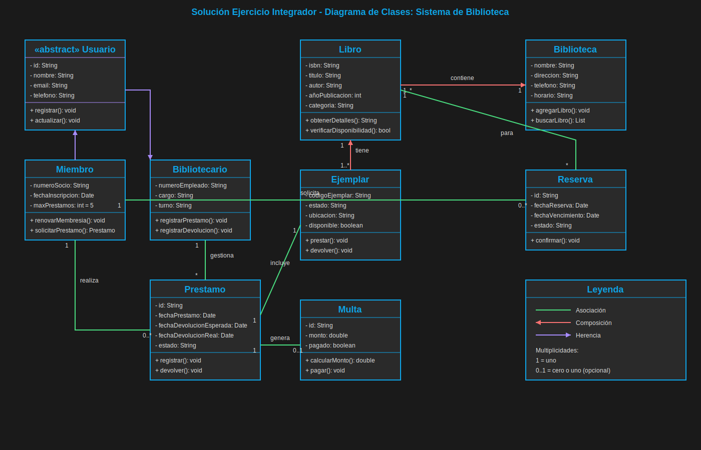
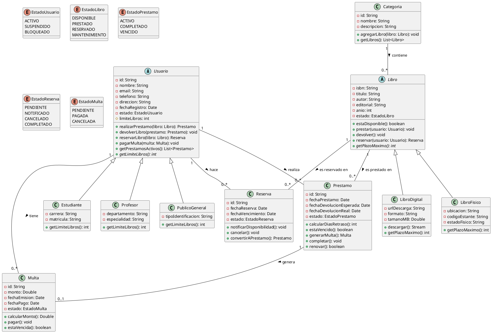
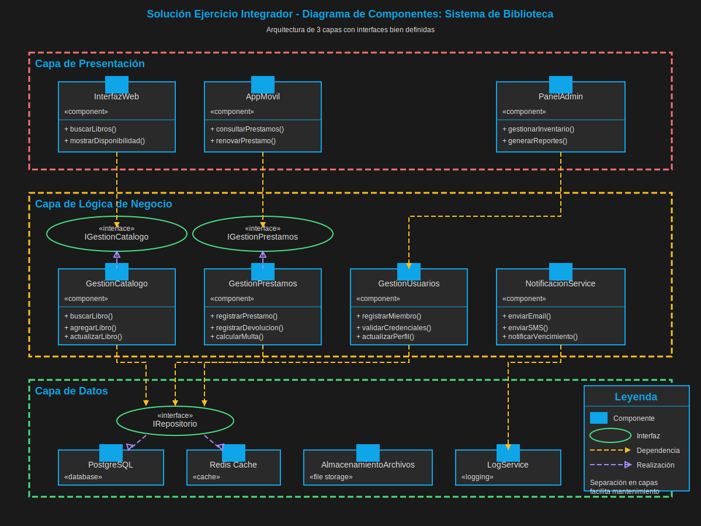
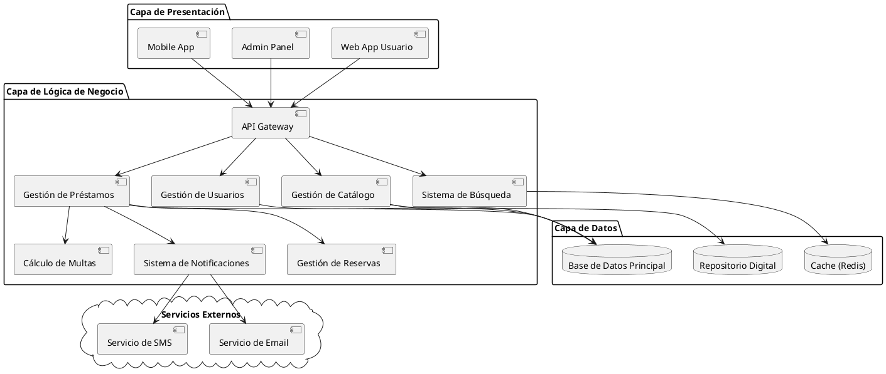

# Módulo 1.4: Ejercicio Integrador - Sesión 1

## ⏱️ Duración: 30 minutos

## 🎯 Objetivos

- Integrar todos los conceptos de la Sesión 1
- Aplicar diagramas estructurales a un caso real
- Practicar toma de decisiones de diseño
- Prepararse para la Sesión 2

---

## 🏢 Caso de Estudio: Sistema de Gestión de Biblioteca

### 📋 Descripción del Sistema

La Biblioteca Municipal necesita un sistema para gestionar:

- **Catálogo de libros** (físicos y digitales)
- **Gestión de usuarios** (estudiantes, profesores, público general)
- **Sistema de préstamos** y devoluciones
- **Multas** por retraso
- **Reservas** de libros prestados
- **Sistema de búsqueda** avanzada
- **Reportes** de estadísticas

### 👥 Roles Identificados

1. **Usuario Regular**: Puede buscar y tomar prestado libros
2. **Bibliotecario**: Gestiona préstamos, devoluciones y multas
3. **Administrador**: Gestiona el catálogo y usuarios del sistema

---

## 📝 Ejercicio 1: Diagrama de Clases Completo (20 min)

### Requisitos Funcionales

**Entidades principales**:

1. **Usuario**

   - Tipos: Estudiante (3 libros max), Profesor (5 libros max), Público (2 libros max)
   - Datos: ID, nombre, email, teléfono, dirección
   - Estado: Activo/Suspendido
   - Multas acumuladas

2. **Libro**

   - Tipos: LibroFisico, LibroDigital
   - Datos: ISBN, título, autor, editorial, año, categoría
   - Estado: Disponible, Prestado, Reservado, Mantenimiento
   - LibroFisico: ubicación física, código de estante
   - LibroDigital: URL descarga, formato (PDF, EPUB), tamaño

3. **Préstamo**

   - Usuario que toma prestado
   - Libro prestado
   - Fecha de préstamo
   - Fecha de devolución esperada
   - Fecha de devolución real
   - Estado: Activo, Completado, Vencido

4. **Reserva**

   - Usuario que reserva
   - Libro reservado
   - Fecha de reserva
   - Estado: Pendiente, Notificado, Cancelado

5. **Multa**

   - Usuario multado
   - Préstamo relacionado
   - Monto
   - Fecha de emisión
   - Estado: Pendiente, Pagada

6. **Categoria**
   - Nombre (Ficción, Historia, Ciencia, etc.)
   - Descripción
   - Libros de la categoría

### 🎨 Tu Tarea

Crea un **Diagrama de Clases** que incluya:

✅ **Todas las clases** con sus atributos y métodos principales
✅ **Relaciones apropiadas**:

- Herencia (Usuario → Estudiante, Profesor, Público)
- Herencia (Libro → LibroFisico, LibroDigital)
- Composición (Préstamo contiene referencia a Usuario y Libro)
- Asociación (Usuario-Préstamo, Libro-Categoría)

✅ **Visibilidad correcta** de atributos y métodos
✅ **Multiplicidades** en todas las relaciones

### 💡 Pistas

```
Relaciones clave:
- Usuario [1] ---- [0..*] Préstamo
- Libro [1] ---- [0..*] Préstamo
- Usuario [1] ---- [0..*] Reserva
- Libro [1] ---- [0..*] Reserva
- Usuario [1] ---- [0..*] Multa
- Préstamo [1] ---- [0..1] Multa
- Categoria [1] ---- [0..*] Libro
```

### Métodos sugeridos:

```java
Usuario:
+ realizarPrestamo(libro: Libro): Prestamo
+ devolverLibro(prestamo: Prestamo): void
+ reservarLibro(libro: Libro): Reserva
+ pagarMulta(multa: Multa): void
+ getPrestamosActivos(): List<Prestamo>

Libro:
+ estaDisponible(): boolean
+ prestar(usuario: Usuario): void
+ devolver(): void
+ reservar(usuario: Usuario): Reserva

Prestamo:
+ calcularDiasRetraso(): int
+ estaVencido(): boolean
+ generarMulta(): Multa
+ completar(): void

Multa:
+ calcularMonto(): Double
+ pagar(): void
+ estaVencida(): boolean
```

---

## 📝 Ejercicio 2: Diagrama de Objetos - Ejemplo (5 min)

Crea un **Diagrama de Objetos** que muestre un escenario específico:

**Escenario**: Juan Pérez (estudiante) tiene prestados 2 libros, uno está vencido y tiene una multa pendiente.

```
Objetos a mostrar:
- juan: Estudiante
- libro1: LibroFisico (Clean Code)
- libro2: LibroFisico (Design Patterns)
- prestamo1: Prestamo (activo, no vencido)
- prestamo2: Prestamo (vencido)
- multa1: Multa (pendiente, $5.00)
```

---

## 📝 Ejercicio 3: Diagrama de Componentes (5 min)

Diseña la **arquitectura de componentes** del sistema:

### Componentes requeridos:

**Capa de Presentación**:

- Web App (para usuarios)
- Admin Panel (para bibliotecarios)

**Capa de Lógica**:

- Gestión de Préstamos
- Gestión de Usuarios
- Gestión de Catálogo
- Sistema de Búsqueda
- Cálculo de Multas
- Sistema de Notificaciones

**Capa de Datos**:

- Base de Datos Principal
- Repositorio de Libros Digitales

**Servicios Externos**:

- Servicio de Email
- Servicio de SMS

### 🎨 Tu Tarea

Crea el diagrama mostrando:

- Todos los componentes organizados por capas
- Dependencias entre componentes
- Interfaces proporcionadas y requeridas

---

## ✅ Solución Propuesta

### Diagrama de Clases





### Diagrama de Componentes





---

## 🎯 Criterios de Evaluación

### Diagrama de Clases (50%)

- ✅ Todas las clases con atributos necesarios (15%)
- ✅ Métodos principales implementados (15%)
- ✅ Relaciones correctas y bien tipificadas (10%)
- ✅ Multiplicidades correctas (5%)
- ✅ Uso apropiado de herencia (5%)

### Diagrama de Componentes (30%)

- ✅ Componentes organizados por capas (10%)
- ✅ Dependencias claras (10%)
- ✅ Consideración de escalabilidad (10%)

### Diagrama de Objetos (20%)

- ✅ Objetos con valores concretos (10%)
- ✅ Relaciones entre objetos (10%)

---

## 💡 Reflexiones y Aprendizajes

### Decisiones de Diseño Importantes

1. **¿Por qué usar herencia para Usuario y Libro?**

   - Comparten comportamiento común
   - Cada tipo tiene reglas específicas
   - Facilita extensibilidad

2. **¿Por qué Composición entre Préstamo y Multa?**

   - Una multa no existe sin un préstamo
   - Ciclo de vida dependiente

3. **¿Separar LibroFisico y LibroDigital?**
   - Reglas de préstamo diferentes
   - Atributos específicos distintos
   - Pueden evolucionar independientemente

### Patrones Aplicados

```
✓ Template Method: getLimiteLibros() en jerarquía Usuario
✓ Strategy: Diferentes cálculos de multa
✓ State: Estados de Libro y Préstamo
✓ Repository: Acceso a datos
```

---

## 🎓 Resumen de la Sesión 1

### Lo que hemos aprendido:

1. ✅ **Fundamentos de UML**

   - Historia y propósito
   - Tipos de diagramas
   - Cuándo usar UML

2. ✅ **Diagrama de Clases**

   - Sintaxis completa
   - Todos los tipos de relaciones
   - Patrones de diseño básicos

3. ✅ **Diagramas Estructurales**

   - Diagrama de Objetos
   - Diagrama de Componentes
   - Diagrama de Despliegue

4. ✅ **Práctica Integrada**
   - Caso real completo
   - Toma de decisiones de diseño
   - Aplicación de buenas prácticas

---

## 🚀 Preparación para Sesión 2

En la próxima sesión veremos:

1. **Diagramas de Comportamiento**

   - Casos de Uso (requisitos)
   - Secuencia (interacciones temporales)
   - Estados (ciclo de vida)
   - Actividades (procesos)

2. **Proyecto Final**
   - Integración completa
   - Sistema real end-to-end

### 📚 Material de Estudio Recomendado

- Revisar relaciones entre clases
- Practicar con PlantUML
- Pensar en sistemas que uses diariamente

---

## ✅ Autoevaluación

Antes de la Sesión 2, deberías poder:

- [ ] Crear diagramas de clases complejos
- [ ] Elegir el tipo de relación apropiada
- [ ] Aplicar herencia y composición
- [ ] Diseñar arquitectura de componentes
- [ ] Documentar decisiones de diseño

---

**¡Felicitaciones!** Has completado la Sesión 1.

**Tiempo de descanso**: 15 minutos antes de la Sesión 2

---

## 📎 Recursos Adicionales

- [Solución completa en PlantUML](./ejercicios/biblioteca-completo.puml)
- [Código Java generado](./ejercicios/biblioteca-codigo-java/)
- [Variaciones del ejercicio](./ejercicios/variaciones-biblioteca.md)
