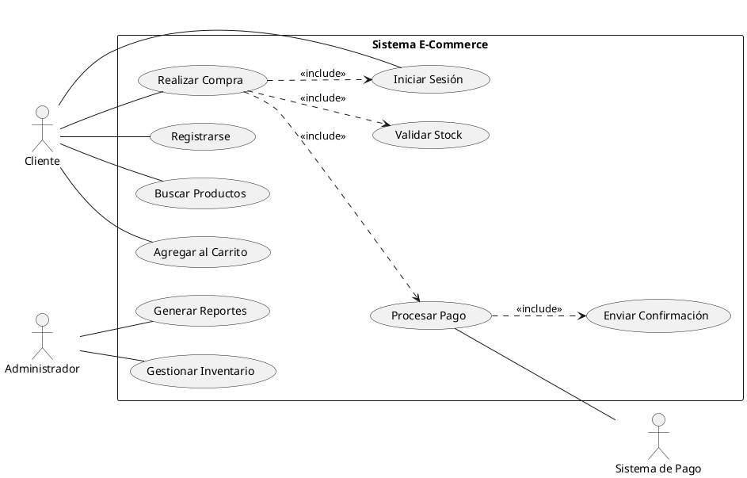
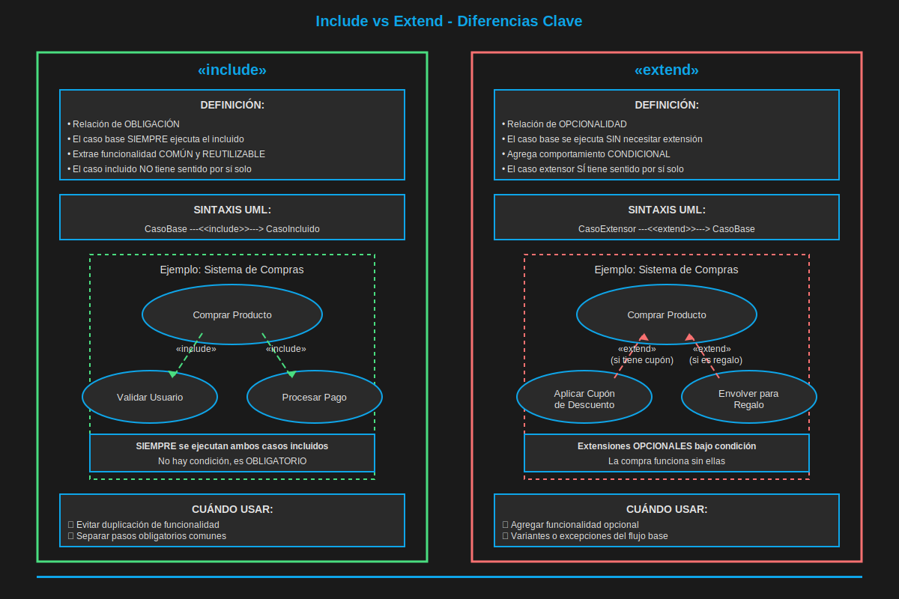

# Módulo 2.1: Diagrama de Casos de Uso

## ⏱️ Duración: 1 hora

## 🎯 Objetivos del Módulo

- Dominar el diagrama más importante para captura de requisitos
- Identificar actores y casos de uso en sistemas reales
- Aplicar relaciones entre casos de uso
- Documentar requisitos funcionales efectivamente

---

## 📖 ¿Qué es un Diagrama de Casos de Uso?

El **Diagrama de Casos de Uso** es fundamental en el **análisis de requisitos**. Muestra:

- **Qué hace el sistema** desde la perspectiva del usuario
- **Quién** interactúa con el sistema (actores)
- **Cómo** se relacionan las funcionalidades

### ⭐ Importancia en Análisis de Sistemas

```
Ranking de uso en Análisis de Sistemas:
1. Diagrama de Casos de Uso    ⭐⭐⭐⭐⭐ (Requisitos)
2. Diagrama de Clases           ⭐⭐⭐⭐⭐ (Diseño)
3. Diagrama de Secuencia        ⭐⭐⭐⭐ (Flujos)
4. Diagrama de Componentes      ⭐⭐⭐⭐ (Arquitectura)
5. Diagrama de Actividades      ⭐⭐⭐ (Procesos)
```

---

## 🎨 Elementos del Diagrama

### 1. Actores 🎭

Representan roles externos que interactúan con el sistema.

```
    👤
   ───
  Nombre
```

**Tipos de Actores**:

- **Primarios**: Usuarios principales (ej: Cliente, Administrador)
- **Secundarios**: Sistemas externos (ej: Pasarela de pago, API externa)
- **Iniciadores**: Los que inician casos de uso
- **Participantes**: Involucrados pero no inician

### 2. Casos de Uso ⭕

Funcionalidades o servicios que el sistema proporciona.

```
  ╭─────────────╮
  │ Realizar    │
  │ Compra      │
  ╰─────────────╯
```

**Características**:

- Verbos en infinitivo
- Representan objetivos del usuario
- Valor agregado al actor

### 3. Relaciones

#### a) Asociación (línea simple)

```
Actor ───── (Caso de Uso)
```

#### b) Include «include» (flecha discontinua)

Caso de uso SIEMPRE incluye otro

```
(Login) ←·····«include»····· (Realizar Compra)
```

#### c) Extend «extend» (flecha discontinua)

Caso de uso OPCIONALMENTE extiende otro

```
(Pagar con Cupón) ·····«extend»·····→ (Procesar Pago)
```

#### d) Generalización (flecha con triángulo)

Herencia entre actores o casos de uso

```
      (Pagar)
         △
         │
    ┌────┴────┐
(Pagar con   (Pagar con
 Tarjeta)     PayPal)
```

---

## 🌍 Ejemplo Completo: Sistema de E-Commerce


### Actores:

- **Cliente**: Usuario que compra
- **Administrador**: Gestiona el sistema
- **Sistema de Pago**: Servicio externo

### Casos de Uso Principales:

1. Registrarse
2. Iniciar Sesión
3. Buscar Productos
4. Agregar al Carrito
5. Realizar Compra
6. Procesar Pago
7. Gestionar Inventario
8. Generar Reportes



---

## 📝 Documentación de Casos de Uso

Cada caso de uso debe documentarse con:

### Plantilla Estándar

```markdown
## CU-001: Realizar Compra

**Actor Principal**: Cliente

**Precondiciones**:

- Usuario autenticado
- Carrito con al menos un producto
- Productos en stock

**Flujo Principal**:

1. Cliente selecciona "Procesar Compra"
2. Sistema muestra resumen del pedido
3. Cliente confirma la compra
4. Sistema valida stock disponible
5. Sistema solicita método de pago
6. Cliente ingresa datos de pago
7. Sistema procesa el pago
8. Sistema genera orden de compra
9. Sistema envía confirmación por email
10. Sistema muestra número de orden

**Flujos Alternativos**:

- 4a. Stock insuficiente

  - Sistema notifica al cliente
  - Cliente puede remover producto o cancelar

- 7a. Pago rechazado
  - Sistema notifica error
  - Cliente puede reintentar o usar otro método

**Postcondiciones**:

- Orden de compra creada
- Stock actualizado
- Email de confirmación enviado
- Carrito vaciado

**Frecuencia de Uso**: Alta (diaria)
**Prioridad**: Alta
```

---

## 🎯 Buenas Prácticas

### ✅ BIEN

```
✓ Nombres claros con verbos en infinitivo
  "Realizar Compra" ✓
  "Buscar Producto" ✓

✓ Perspectiva del usuario
  "Consultar Saldo" (no "Mostrar Saldo")

✓ Nivel de detalle apropiado
  No demasiado granular: "Click en botón"
  No demasiado abstracto: "Usar sistema"

✓ Enfoque en funcionalidad
  Qué hace, no cómo lo hace

✓ Casos de uso independientes
  Cada uno con valor propio
```

### ❌ MAL

```
✗ "Sistema valida datos"
  (Perspectiva del sistema, no del usuario)

✗ "Hacer cosas"
  (Demasiado vago)

✗ "Click en botón Login"
  (Demasiado detallado)

✗ Incluir diseño de UI
  "Mostrar ventana con 3 botones"

✗ Mezclar casos de uso con tareas técnicas
  "Conectar a base de datos"
```

---

## 🔍 Relaciones: ¿Cuándo usar Include vs Extend?

### «include» - SIEMPRE se ejecuta

```
Use cuando:
✓ Comportamiento común obligatorio
✓ Evitar duplicación
✓ Funcionalidad siempre necesaria

Ejemplo:
  Realizar Compra SIEMPRE incluye Validar Stock
  Cualquier operación SIEMPRE incluye Autenticar Usuario
```

### «extend» - OPCIONALMENTE se ejecuta

```
Use cuando:
✓ Comportamiento opcional
✓ Casos especiales
✓ Variaciones de flujo

Ejemplo:
  Aplicar Cupón EXTIENDE Procesar Pago (opcional)
  Guardar Tarjeta EXTIENDE Pagar (opcional)
```

### 📊 Comparación Visual



---

## 🌟 Ejemplos de la Vida Real

### 1. Netflix

**Actores**: Usuario, Administrador de Contenido

**Casos de Uso**:

- Ver Contenido
- Buscar Películas/Series
- Agregar a Mi Lista
- Calificar Contenido
- Gestionar Perfil
- Recibir Recomendaciones
- Administrar Catálogo
- Generar Estadísticas

**Relaciones**:

- "Ver Contenido" include "Autenticar Usuario"
- "Ver Contenido" include "Registrar Visualización"
- "Activar Subtítulos" extend "Ver Contenido"

### 2. Sistema Bancario Online

**Actores**: Cliente, Cajero, Gerente

**Casos de Uso**:

- Consultar Saldo
- Realizar Transferencia
- Pagar Servicios
- Solicitar Préstamo
- Generar Estado de Cuenta
- Bloquear Tarjeta
- Aprobar Préstamos
- Auditar Transacciones

### 3. Sistema Hospitalario

**Actores**: Paciente, Médico, Enfermera, Administrativo

**Casos de Uso**:

- Agendar Cita
- Consultar Historia Clínica
- Prescribir Medicamento
- Registrar Signos Vitales
- Procesar Admisión
- Generar Factura
- Gestionar Inventario de Medicinas

---

## 📝 Ejercicio 4: Sistema Universitario (30 min)

### Requisitos

Diseña el diagrama de casos de uso para un sistema de gestión universitaria.

**Actores**:

- Estudiante
- Profesor
- Coordinador Académico
- Sistema de Pagos

**Funcionalidades mínimas**:

1. Inscribirse en cursos
2. Ver horario
3. Consultar notas
4. Registrar asistencia
5. Subir calificaciones
6. Gestionar oferta académica
7. Generar reportes
8. Procesar pagos de matrícula

**Especificaciones**:

- Identificar relaciones include/extend
- Documentar al menos 3 casos de uso completos
- Considerar precondiciones y flujos alternativos

**Solución**: Ver [solucion-ejercicio-4.md](./ejercicios/solucion-ejercicio-4.md)

---

## 🎯 ENTREGABLES OBLIGATORIOS

> 📦 **ENTREGABLE #4: Diagrama de Casos de Uso - Sistema Universitario**

**Descripción**: Diagrama completo de casos de uso del Ejercicio 4 + documentación de 3 casos de uso

**Requisitos mínimos**:

### A) Diagrama de Casos de Uso

- ✅ Mínimo 4 actores: Estudiante, Profesor, Coordinador, Sistema de Pagos
- ✅ Mínimo 8 casos de uso organizados lógicamente
- ✅ Al menos 2 relaciones «include»
- ✅ Al menos 1 relación «extend»
- ✅ Generalización de actores si aplica
- ✅ Límites del sistema claramente definidos

### B) Documentación de Casos de Uso (3 casos principales)

Usando la plantilla estándar, documentar:

1. **Inscribirse en Cursos**
2. **Registrar Calificaciones**
3. **Generar Reporte Académico**

Cada uno debe incluir:

- ✅ Actor principal y secundarios
- ✅ Precondiciones y postcondiciones
- ✅ Flujo básico (mínimo 5 pasos)
- ✅ Flujos alternativos (mínimo 2)
- ✅ Flujos de excepción

**Formato de entrega**:

- `apellido-modulo2.1-casos-uso.puml` (diagrama)
- `apellido-modulo2.1-documentacion.md` (3 casos documentados)

**Tiempo estimado**: 30 minutos

---

## ✅ Checklist del Módulo

Antes de continuar, asegúrate de:

- [ ] Identificar actores correctamente
- [ ] Nombrar casos de uso apropiadamente
- [ ] Aplicar relaciones include/extend correctamente
- [ ] Documentar casos de uso con plantilla estándar
- [ ] Haber completado el ejercicio 4

---

## ⏭️ Siguiente Módulo

[Módulo 2.2: Diagramas de Secuencia y Comunicación](./modulo-2.2-secuencia-comunicacion.md)
