# Módulo 2.2: Diagramas de Secuencia y Comunicación

## ⏱️ Duración: 1.5 horas

## 🎯 Objetivos del Módulo

- Dominar el diagrama de secuencia (MUY IMPORTANTE en análisis)
- Comprender interacciones temporales entre objetos
- Modelar flujos de procesos complejos
- Conocer el diagrama de comunicación como alternativa

---

## 📖 ¿Qué es un Diagrama de Secuencia?

El **Diagrama de Secuencia** muestra cómo los objetos interactúan entre sí **en el tiempo**. Es uno de los diagramas más importantes para:

- Documentar flujos de casos de uso
- Diseñar APIs
- Entender sistemas existentes
- Comunicar lógica compleja

### ⭐ Importancia en Análisis de Sistemas

```
Ranking en Análisis de Sistemas:
1. Casos de Uso           ⭐⭐⭐⭐⭐ (Requisitos)
2. Diagrama de Clases     ⭐⭐⭐⭐⭐ (Diseño)
3. Diagrama de Secuencia  ⭐⭐⭐⭐⭐ (Flujos)
4. Componentes            ⭐⭐⭐⭐ (Arquitectura)
5. Actividades            ⭐⭐⭐ (Procesos)
```

---

## 🎨 Elementos del Diagrama de Secuencia

### 1. Actores y Objetos (Participantes)

```
┌─────────┐
│ :Actor  │  ← Actor (usuario)
└─────────┘

┌─────────┐
│ :Objeto │  ← Objeto del sistema
└─────────┘
```

### 2. Línea de Vida

```
┌─────────┐
│ :Objeto │
└────┬────┘
     │  ← Línea de vida (tiempo hacia abajo)
     │
     │
```

### 3. Mensajes

```
────────────────→  Mensaje síncrono (espera respuesta)
- - - - - - - →  Mensaje asíncrono (no espera)
←- - - - - - -   Mensaje de retorno
```

### 4. Activación

```
     │
     ▌  ← Rectángulo de activación
     ▌     (objeto está procesando)
     │
```

### 5. Fragmentos Combinados

```
┌─── alt [condición] ─────┐  Alternativa (if-else)
│                          │
├─── else ─────────────────┤
│                          │
└──────────────────────────┘

┌─── opt [condición] ─────┐  Opcional (if)
│                          │
└──────────────────────────┘

┌─── loop [condición] ────┐  Bucle (while, for)
│                          │
└──────────────────────────┘
```

---

## 🌍 Ejemplo Básico: Login de Usuario

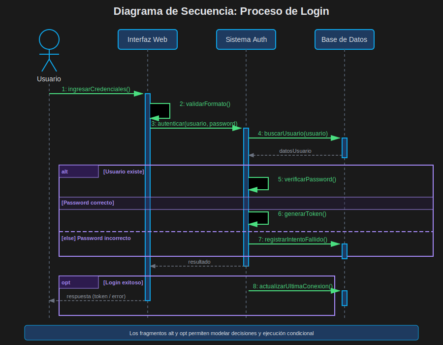

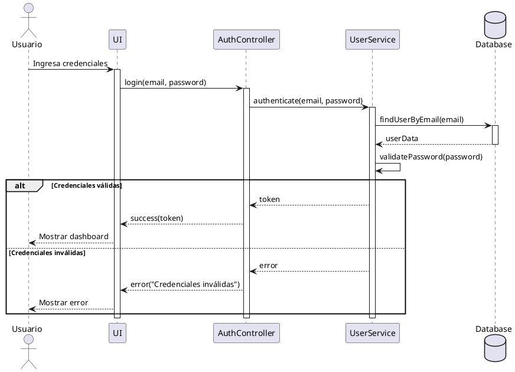

### Análisis del Flujo:

1. **Usuario inicia**: Acción del actor
2. **UI procesa**: Interfaz recibe entrada
3. **Auth valida**: Controlador procesa lógica
4. **Service verifica**: Servicio consulta datos
5. **DB responde**: Base de datos retorna información
6. **Validación**: Lógica de negocio
7. **Alternativa**: Dos caminos posibles
8. **Respuesta**: Sistema responde al usuario

---

## 🔍 Fragmentos Combinados en Detalle

### 1. alt (Alternativa - if/else)

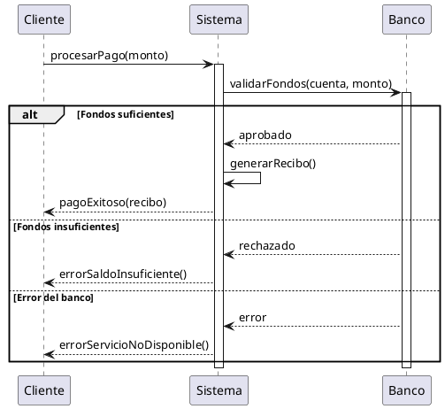

### 2. opt (Opcional - if)

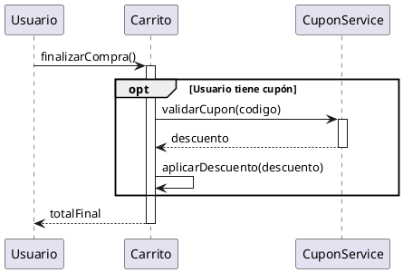

### 3. loop (Bucle - for/while)

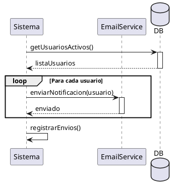

### 4. par (Paralelo - concurrente)

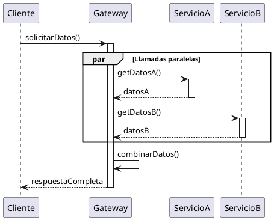

---

## 🌟 Ejemplo Completo: Compra en E-Commerce

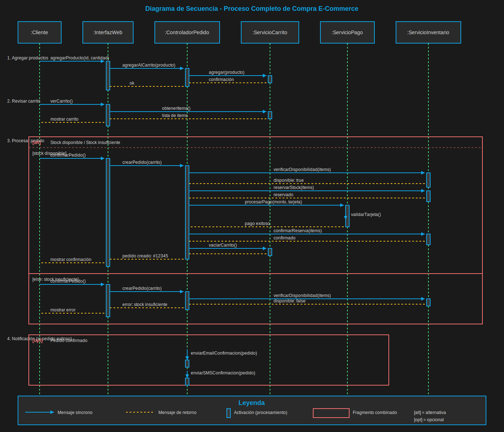

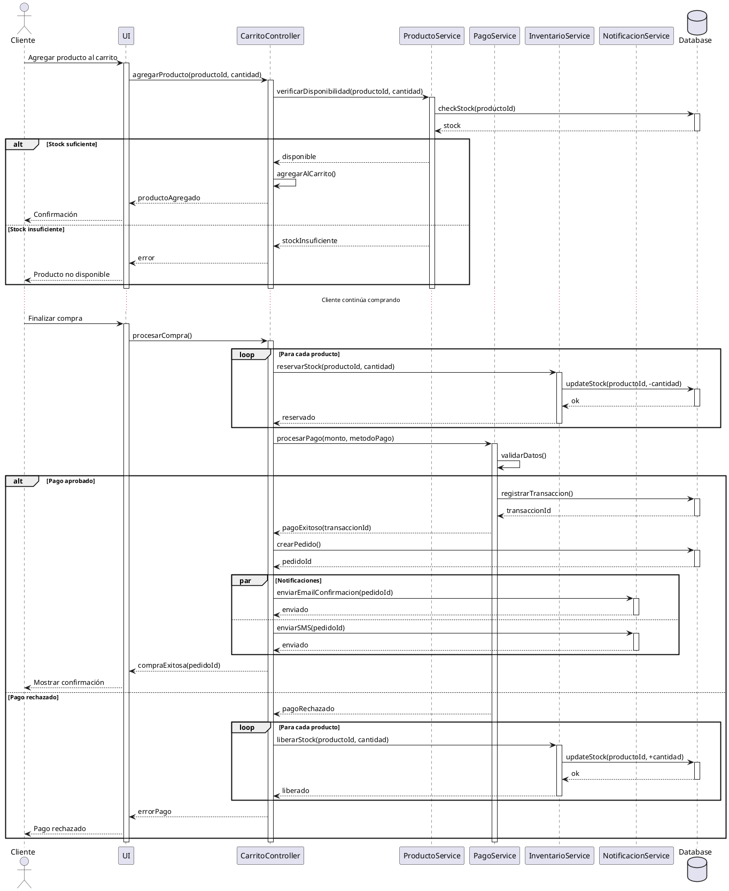

---

## 📊 Diagrama de Comunicación (Alternativa)

El **Diagrama de Comunicación** muestra las mismas interacciones pero enfatiza la **estructura** sobre el tiempo.

### Diferencias clave:

| Aspecto        | Secuencia         | Comunicación           |
| -------------- | ----------------- | ---------------------- |
| **Enfoque**    | Orden temporal    | Estructura de red      |
| **Layout**     | Vertical (tiempo) | Libre (espacial)       |
| **Numeración** | Implícita         | Explícita (1, 2, 3...) |
| **Uso**        | Flujos detallados | Vista general          |

### Ejemplo: Mismo flujo de Login

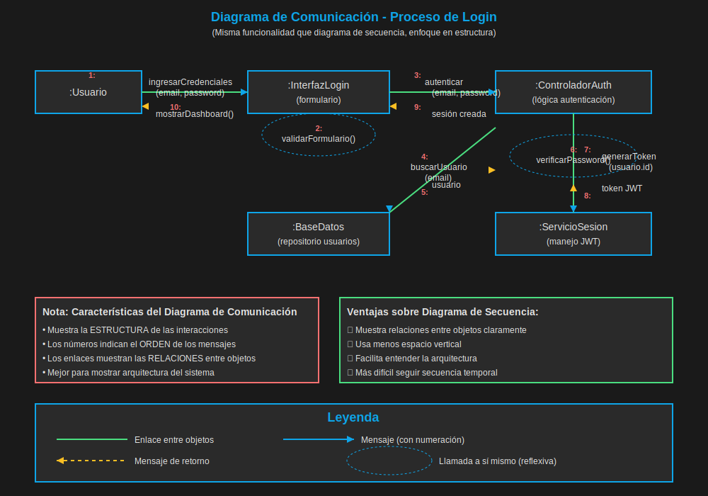

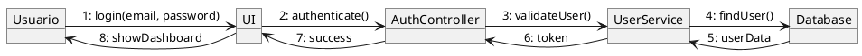

### ¿Cuándo usar cada uno?

```
Usar SECUENCIA cuando:
✓ Necesitas mostrar orden temporal exacto
✓ Flujos complejos con decisiones
✓ Documentación detallada de APIs
✓ Debugging de interacciones

Usar COMUNICACIÓN cuando:
✓ Vista general de relaciones
✓ Documentación de alto nivel
✓ Espacios reducidos
✓ Énfasis en colaboración
```

---

## 🎯 Buenas Prácticas

### ✅ BIEN

```
✓ Nombrar participantes claramente
  ":CarritoController" no "c"

✓ Usar fragmentos para lógica compleja
  alt, opt, loop según corresponda

✓ Mantener nivel de abstracción consistente
  No mezclar bajo nivel con alto nivel

✓ Incluir mensajes de retorno importantes
  No todos, solo los relevantes

✓ Agrupar operaciones relacionadas
  Usar notas o comentarios

✓ Limitar número de participantes
  5-7 objetos máximo por diagrama
```

### ❌ MAL

```
✗ Incluir todos los getters/setters
  Demasiado detalle innecesario

✗ Mezclar lógica de UI con negocio
  Separar responsabilidades

✗ Olvidar casos de error
  Siempre modelar flujos alternativos

✗ Diagramas demasiado largos
  Dividir en múltiples diagramas

✗ No usar fragmentos combinados
  alt/opt/loop hacen más claro el flujo
```

---

## 💡 Patrones Comunes en Secuencia

### 1. Patrón Request-Response

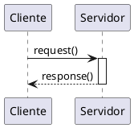

### 2. Patrón Callback

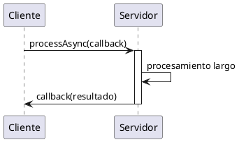

### 3. Patrón Chain of Responsibility

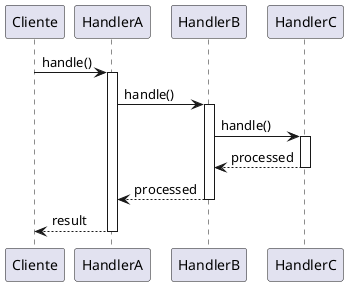

---

## 📝 Ejercicio 5: Sistema Bancario - Transferencia (30 min)

### Escenario

Diseña el diagrama de secuencia para una **transferencia bancaria**:

**Actores**: Cliente

**Participantes**:

- UI
- TransferenciaController
- CuentaService
- ValidacionService
- TransaccionService
- NotificacionService
- Database

**Flujo**:

1. Cliente inicia transferencia (cuenta origen, cuenta destino, monto)
2. Sistema valida que ambas cuentas existan
3. Sistema verifica saldo suficiente en cuenta origen
4. Sistema verifica límites diarios de transferencia
5. Si todo OK:
   - Debitar cuenta origen
   - Acreditar cuenta destino
   - Registrar transacción
   - Enviar notificaciones a ambos clientes
6. Si hay errores:
   - Notificar error específico
   - No realizar operación

**Incluye**:

- Fragmentos alt para validaciones
- Fragmento par para notificaciones paralelas
- Manejo de al menos 3 casos de error

**Solución**: Ver [solucion-ejercicio-5.md](./ejercicios/solucion-ejercicio-5.md)

---

## ✅ Checklist del Módulo

Antes de continuar, asegúrate de:

- [ ] Crear diagramas de secuencia con sintaxis correcta
- [ ] Usar fragmentos combinados apropiadamente
- [ ] Modelar flujos con múltiples alternativas
- [ ] Distinguir entre secuencia y comunicación
- [ ] Haber completado el ejercicio 5

---

## ⏭️ Siguiente Módulo

[Módulo 2.3: Diagramas de Estados y Actividades](./modulo-2.3-estados-actividades.md)
