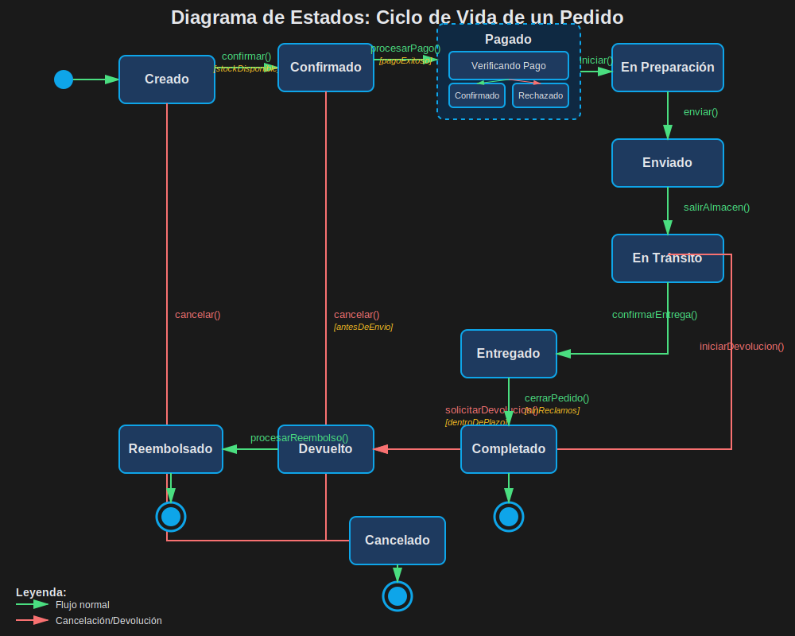
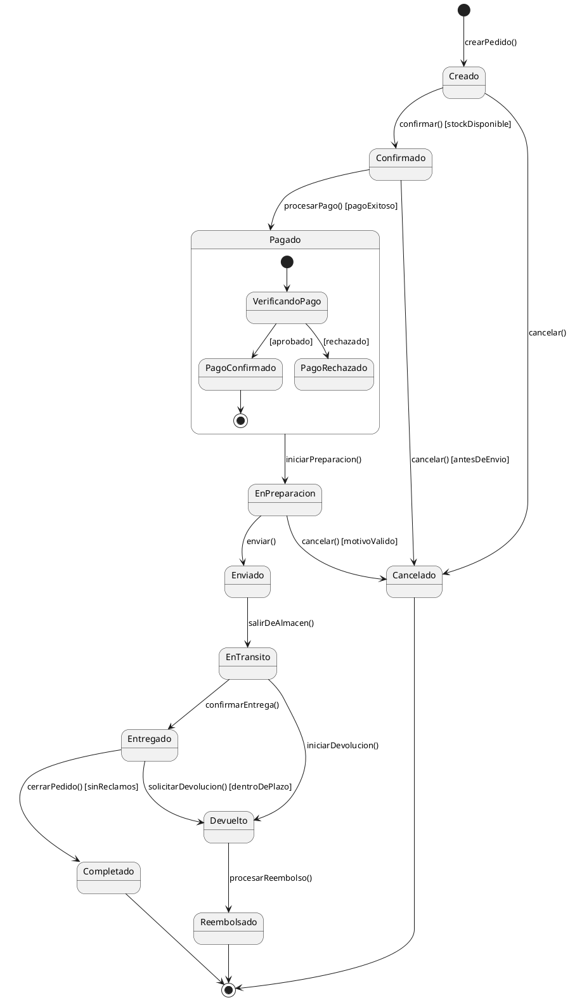
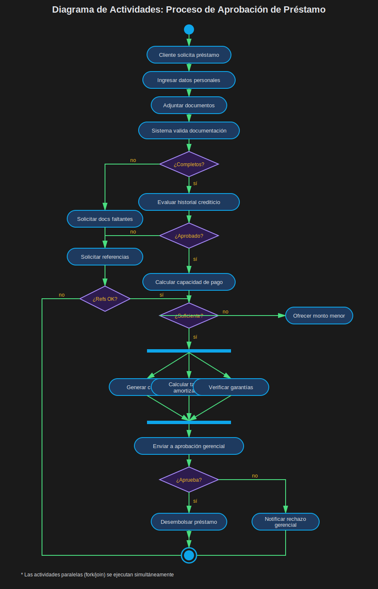
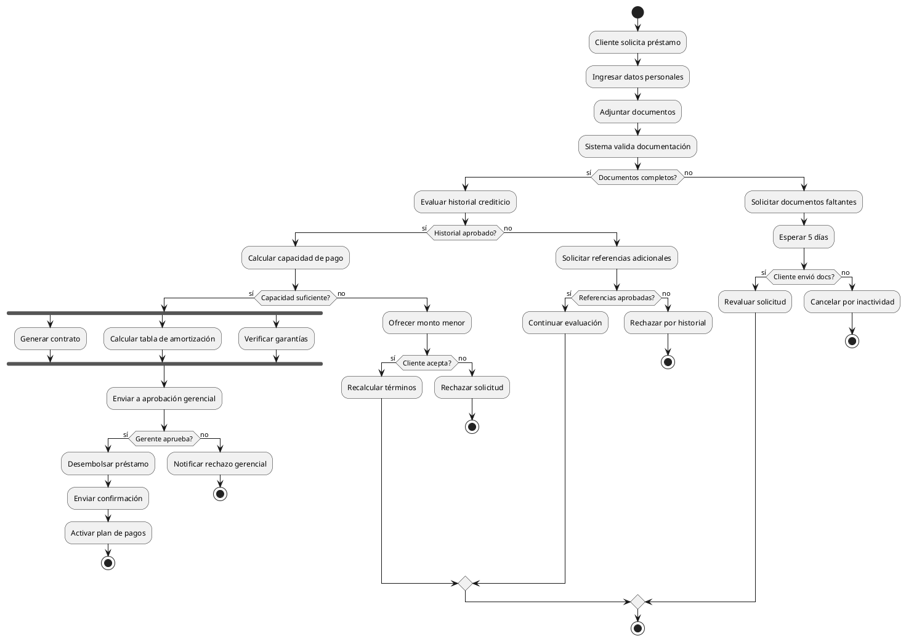
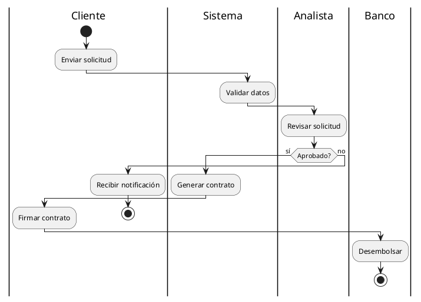
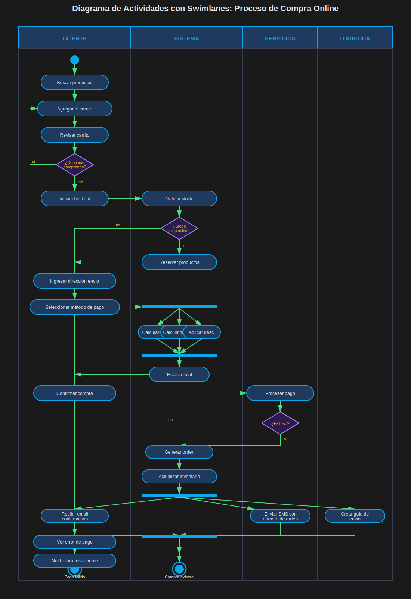
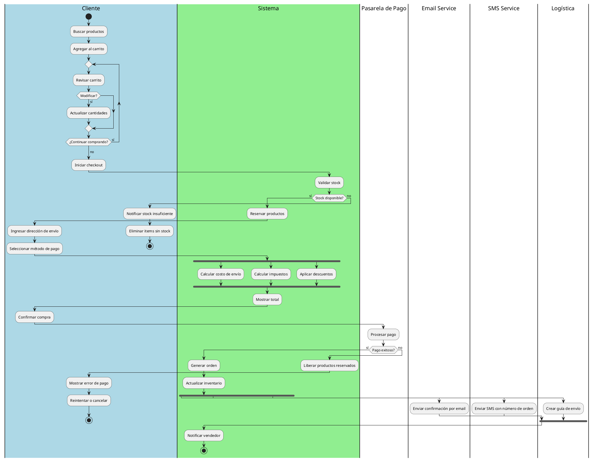

# Módulo 2.3: Diagramas de Estados y Actividades

## ⏱️ Duración: 1 hora

## 🎯 Objetivos del Módulo

- Modelar ciclos de vida con diagramas de estados
- Diseñar procesos de negocio con diagramas de actividades
- Aplicar estos diagramas a casos reales
- Saber cuándo usar cada tipo

---

## 1️⃣ DIAGRAMA DE ESTADOS

## 📖 ¿Qué es?

El **Diagrama de Estados** (State Machine) muestra los diferentes estados de un objeto y cómo transita entre ellos en respuesta a eventos.

### 🎯 Cuándo usarlo

✅ **Usar cuando**:

- Un objeto tiene ciclo de vida complejo
- El comportamiento depende del estado actual
- Hay reglas de transición claras
- Necesitas validar flujos de estado

**Ejemplos típicos**: Pedido, Solicitud, Proceso de aprobación, Conexión, Transacción

---

## 🎨 Elementos del Diagrama

### Estados

```
┌──────────────┐
│   Estado     │  ← Estado simple
└──────────────┘

● ← Estado inicial (círculo negro)

◉ ← Estado final (círculo con borde)
```

### Transiciones

```
Estado1 ──evento [condición] / acción──→ Estado2

Donde:
- evento: Lo que dispara la transición
- [condición]: Guarda opcional
- /acción: Operación opcional al transitar
```

### Ejemplo Básico

```
● ─→ [Apagado] ──encender──→ [Encendido] ──apagar──→ [Apagado]
                                   │
                                   └──error──→ ◉
```

---

## 🌍 Ejemplo: Ciclo de Vida de un Pedido





### Análisis del Diagrama:

**Estados identificados**:

1. **Creado**: Pedido iniciado
2. **Confirmado**: Stock verificado
3. **Pagado**: Pago procesado (con subestados)
4. **EnPreparacion**: Empacando productos
5. **Enviado**: Salió del almacén
6. **EnTransito**: En camino al cliente
7. **Entregado**: Recibido por cliente
8. **Completado**: Proceso finalizado exitosamente
9. **Cancelado**: Pedido cancelado
10. **Devuelto**: Cliente devolvió pedido
11. **Reembolsado**: Dinero devuelto

**Transiciones con condiciones**:

- `confirmar() [stockDisponible]`
- `cancelar() [antesDeEnvio]`
- `solicitarDevolucion() [dentroDePlazo]`

---

## 🎯 Buenas Prácticas - Estados

### ✅ BIEN

```
✓ Estados con nombres claros
  "EnProceso", "Aprobado", "Rechazado"

✓ Transiciones con eventos explícitos
  "aprobar()", "rechazar()", "expirar()"

✓ Condiciones en guardas
  [saldoSuficiente], [dentroDePlazo]

✓ Estados finales claros
  Completado, Cancelado, Expirado

✓ Acciones en transiciones
  / enviarNotificacion(), / actualizarInventario()
```

### ❌ MAL

```
✗ Estados ambiguos
  "Estado1", "Proceso"

✗ Demasiados estados
  Más de 10-12 estados principales

✗ Transiciones sin eventos
  Flechas sin etiquetas

✗ Ciclos infinitos sin salida
  Estados sin camino a final

✗ Falta de estados de error
  No considerar casos excepcionales
```

---

## 2️⃣ DIAGRAMA DE ACTIVIDADES

## 📖 ¿Qué es?

El **Diagrama de Actividades** modela flujos de trabajo y procesos de negocio. Similar a un flowchart pero con semántica UML.

### 🎯 Cuándo usarlo (MUY COMÚN)

✅ **Usar cuando**:

- Documentar procesos de negocio
- Modelar algoritmos complejos
- Diseñar workflows
- Mostrar flujos paralelos

**Ranking**: ⭐⭐⭐⭐ Alto uso en análisis de sistemas

---

## 🎨 Elementos del Diagrama

### Nodos de Actividad

```
● ← Inicio

┌──────────────┐
│  Actividad   │  ← Acción/Tarea
└──────────────┘

◇ ← Decisión (if/switch)

◇ ← Merge (unir caminos)

┌────────┐
│        │  ← Fork (dividir en paralelo)
└────────┘

┌────────┐
│        │  ← Join (unir paralelos)
└────────┘

◉ ← Fin
```

---

## 🌍 Ejemplo: Proceso de Aprobación de Préstamo





### Elementos del Ejemplo:

1. **Actividades secuenciales**: Flujo normal
2. **Decisiones múltiples**: if-else anidados
3. **Fork/Join**: Tareas paralelas (generar contrato + calcular amortización + verificar garantías)
4. **Swimlanes**: Podríamos agregar carriles por rol

---

## 🏊 Swimlanes (Carriles)

Los **swimlanes** organizan actividades por actor o departamento.



---

## 🌟 Ejemplo Completo: Proceso de Compra Online





---

## 📊 Estados vs Actividades: ¿Cuál usar?

| Aspecto           | Diagrama de Estados     | Diagrama de Actividades |
| ----------------- | ----------------------- | ----------------------- |
| **Enfoque**       | Estados del objeto      | Flujo de trabajo        |
| **Perspectiva**   | Un objeto               | Proceso completo        |
| **Uso principal** | Ciclo de vida           | Proceso de negocio      |
| **Eventos**       | Externos al objeto      | Acciones secuenciales   |
| **Decisiones**    | Guardas en transiciones | Nodos de decisión       |
| **Paralelismo**   | Estados concurrentes    | Fork/Join               |

### Ejemplo comparativo:

**Pedido de Pizza**

**Estados** (del pedido):

```
Nuevo → EnPreparacion → Horneando → Listo → Entregado
```

**Actividades** (del proceso):

```
Recibir orden → Preparar masa → Agregar ingredientes →
Hornear → Empacar → Entregar
```

---

## 🎯 Casos de Uso Reales

### 1. Sistema de Tickets de Soporte

**Estados del Ticket**:

```
[Nuevo] → [Asignado] → [EnProgreso] → [Resuelto] → [Cerrado]
              ↓
         [Reabierto] → [EnProgreso]
```

**Actividades del Proceso**:

```
Cliente crea ticket →
Sistema asigna a técnico →
Técnico analiza →
Técnico resuelve →
Cliente verifica →
  Si OK: Cerrar
  Si NO: Reabrir
```

### 2. Proceso de Contratación

**Estados del Candidato**:

```
[Aplicado] → [Screening] → [Entrevista] → [Oferta] → [Contratado]
                ↓              ↓            ↓
           [Rechazado]   [Rechazado]  [Oferta Rechazada]
```

### 3. Workflow de Aprobación de Vacaciones

**Actividades**:

```
Empleado solicita →
Validar días disponibles →
  Fork:
    - Supervisor revisa
    - RRHH verifica política
  Join →
Si ambos aprueban →
  Registrar en sistema →
  Notificar aprobación →
  Actualizar calendario
```

---

## 📝 Ejercicio 6: Proceso de Devolución (30 min)

### Escenario

Diseña AMBOS diagramas para un **proceso de devolución** en e-commerce:

**Requisitos**:

1. **Diagrama de Estados** del objeto "Devolución":

   - Estados: Solicitada, Aprobada, Rechazada, ProductoRecibido, Inspeccionado, Reembolsado, Cerrada
   - Transiciones con eventos y condiciones

2. **Diagrama de Actividades** del proceso completo:
   - Cliente solicita devolución
   - Sistema valida plazo (30 días)
   - Agente revisa motivo
   - Si aprueba:
     - Generar etiqueta de envío
     - Cliente envía producto
     - Almacén inspecciona
     - Si producto OK: Procesar reembolso
     - Si producto dañado: Rechazar reembolso
   - Notificaciones en cada paso

**Incluye**:

- Swimlanes en actividades (Cliente, Sistema, Agente, Almacén, Finanzas)
- Decisiones múltiples
- Al menos un fork/join
- Estados con subestados si es necesario

**Solución**: Ver [solucion-ejercicio-6.md](./ejercicios/solucion-ejercicio-6.md)

---

## 💡 Consejos Prácticos

### Para Diagramas de Estados:

```
1. Identifica los estados principales primero
2. Define estado inicial y finales
3. Agrega transiciones principales
4. Añade guardas y acciones
5. Considera estados de error
6. Valida que no haya estados inalcanzables
```

### Para Diagramas de Actividades:

```
1. Lista todas las actividades
2. Identifica decisiones clave
3. Encuentra actividades paralelas
4. Agrupa por roles (swimlanes)
5. Valida que todos los caminos terminen
6. Considera casos de error y timeouts
```

---

## ✅ Checklist del Módulo

Antes de continuar, asegúrate de:

- [ ] Crear diagramas de estados con transiciones claras
- [ ] Diseñar diagramas de actividades con decisiones
- [ ] Usar swimlanes apropiadamente
- [ ] Saber cuándo usar estados vs actividades
- [ ] Haber completado el ejercicio 6

---

## ⏭️ Siguiente Módulo

[Módulo 2.4: Proyecto Final](./modulo-2.4-proyecto-final.md)
